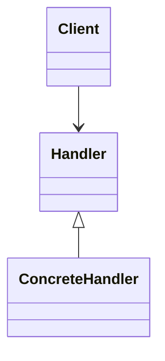

# Behavioral Patterns

## Definition

Behavioral patterns define **communication and interaction between objects**.

They focus on **how responsibilities are distributed and coordinated.**

* * *

## Intent

- Define the clear communication flow.
- Decouple sender and receiver.
- Improve flexibility in behavior.
- Manage complex control flow.

* * *

## Core Patterns

- Chain of Responsibility
- Command
- Interpreter
- Iterator
- Mediator
- Memento
- Observer
- State
- Strategy
- Template Method
- Visitor

* * *

## Structural View

## Architectural Interpretation

- Focus on **behavioral orchestration**
- Reduce **direct dependencies between objects**
- Enable **dynamic behavior changes at runtime**
&nbsp;

* * *