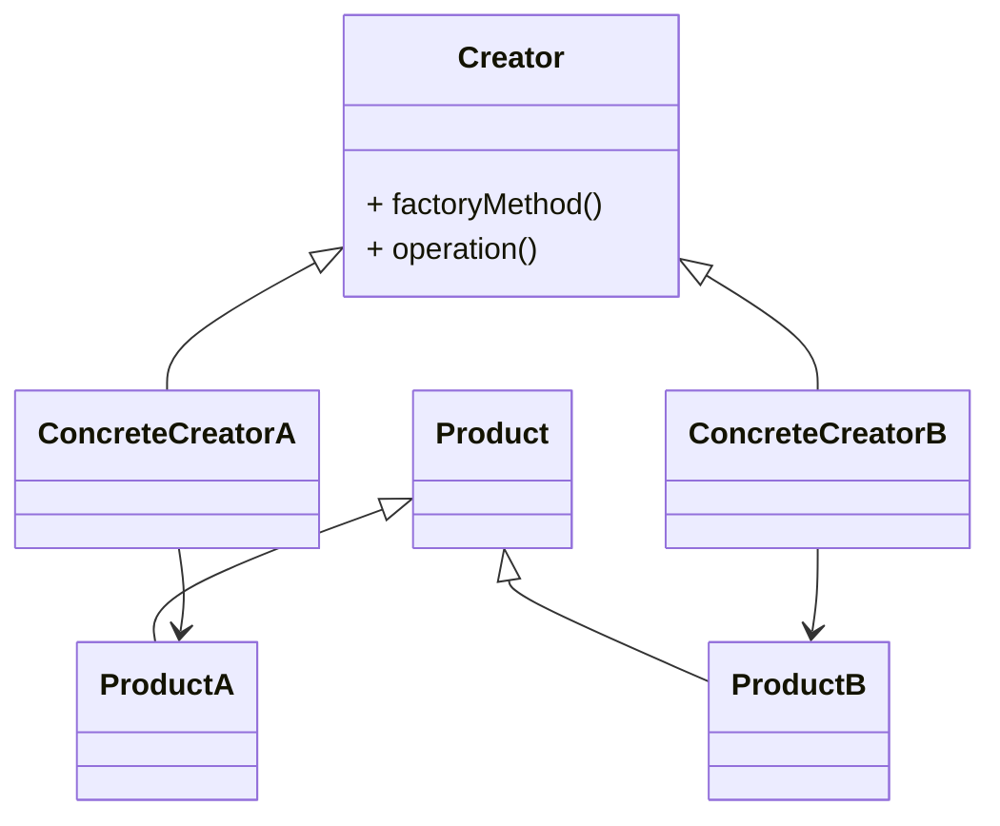
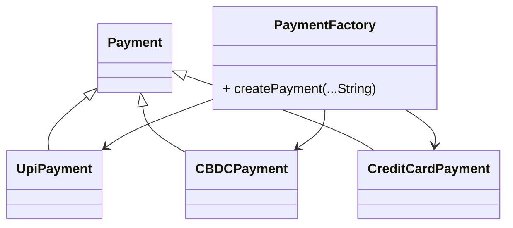
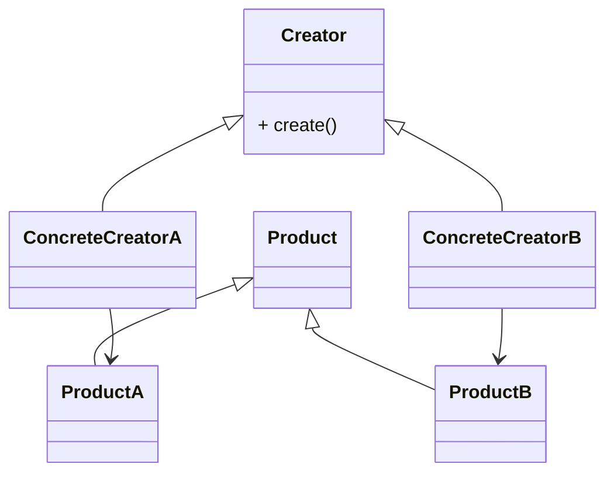
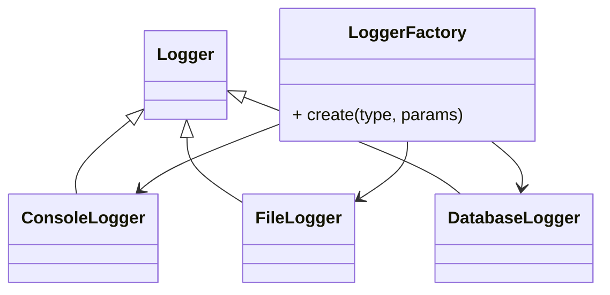
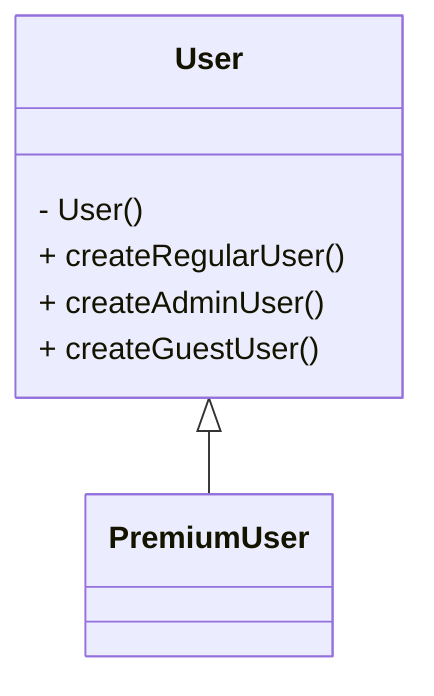
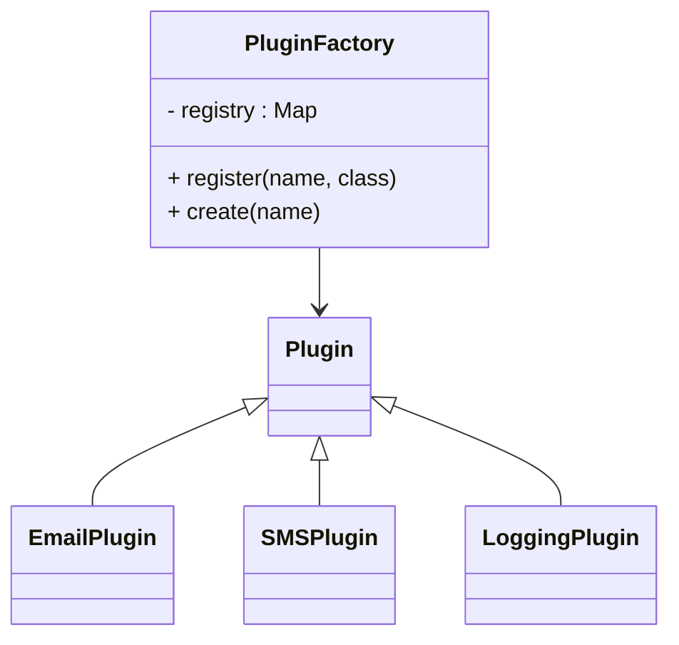
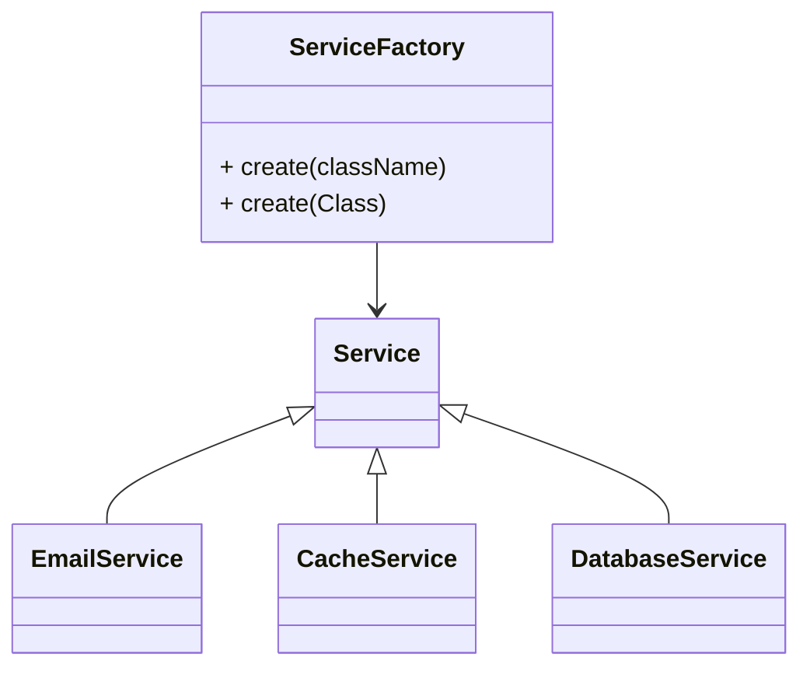
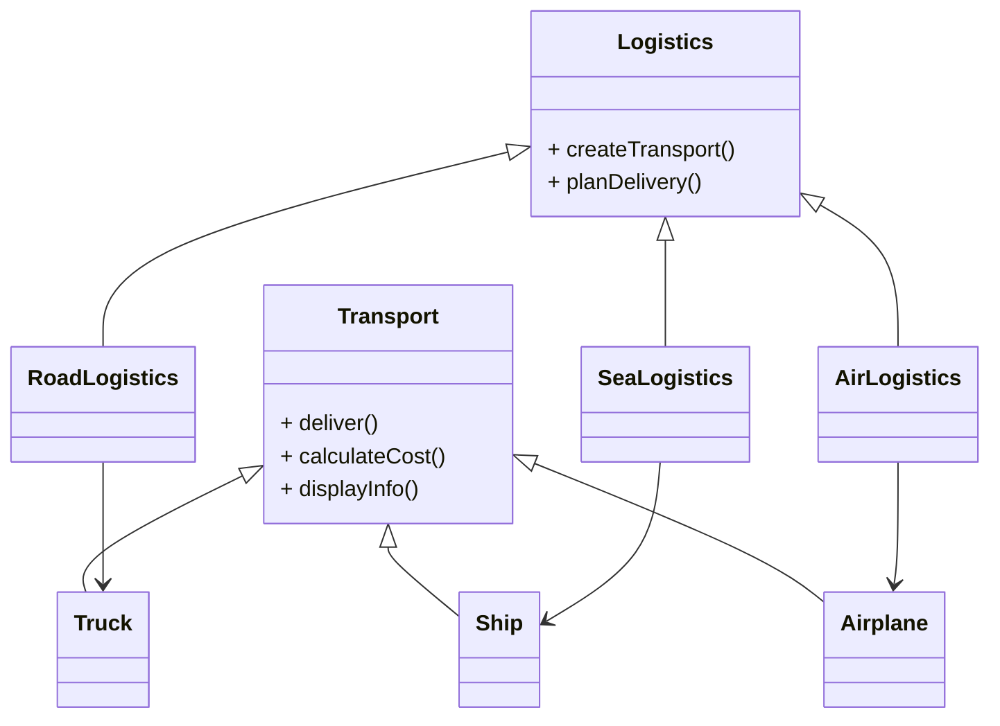
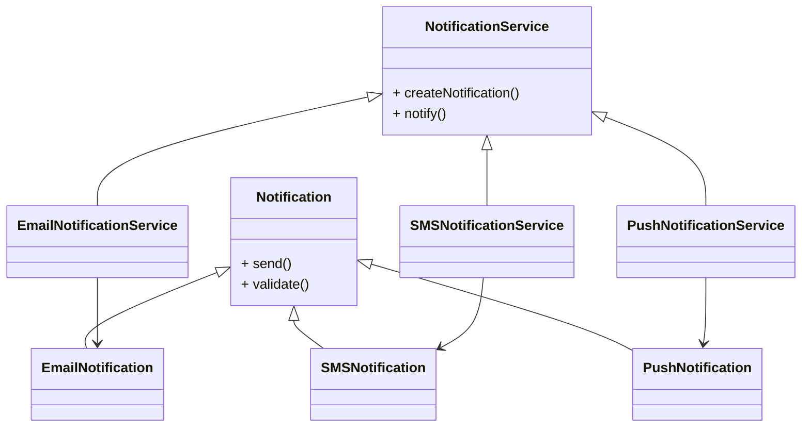
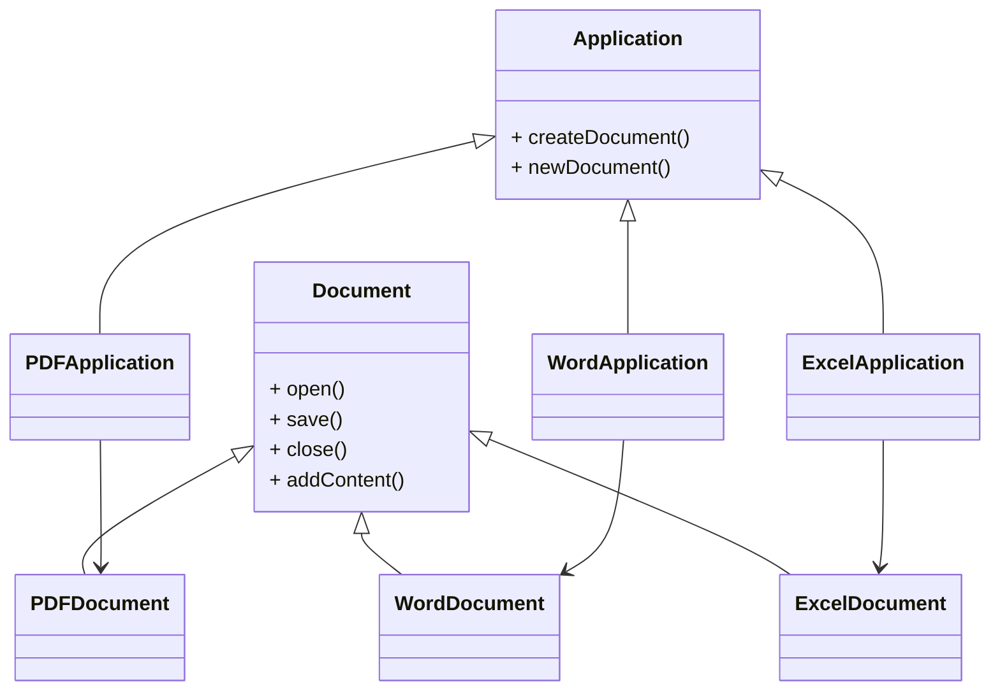

# Factory Method Pattern

Factory Method defines an interface for creating objects, but delegates the decision of which concrete class to instantiate to subclasses.

It separates **object creation** from **object usage**, enabling extensibility without modifying existing code.

* * *

# Definition

Factory Method allows a class to **defer instantiation to subclasses**, ensuring that object creation is controlled and extensible.

Core idea:

Creation is not hardcoded — it is **delegated**.

* * *

# Problem

Direct object creation leads to:

- Tight coupling with concrete classes
- Rigid code when new types are introduced
- Violation of Open/Closed Principle
- Scattered instantiation logic

Using `new` binds the system to specific implementations.

* * *

# Solution

Introduce a **factory method**:

- Defined in a base class (Creator)
- Implemented by subclasses (Concrete Creators)
- Returns objects via a common abstraction (Product)

This shifts responsibility from **client → subclass**.

* * *

# Structure

* * *

# FACTORY PATTERN - All Implementation Types

### Let me explain all variations of Factory patterns with detailed examples.

- Simple Factory
- Factory Method
- Parameterized Factory
- Static Factory
- Registry-Based
- Reflection-Based

* * *

# Type - 1. Simple Factory

## Definition

A centralized factory class that creates objects based on input parameters.

Not a GoF pattern, but widely used in practice.

* * *

## Structure

## Structural Interpretation

- Centralized creation logic
- Client depends only on factory
- Factory decides concrete type

## Design Trade-off

- Violates Open/Closed Principle
- Requires modification for new types

# Type - 2. Factory Method Pattern

## Definition

Defines an interface for object creation while allowing subclasses to decide which class to instantiate.

## Structure

## Structural Interpretation

- Creation responsibility delegated to subclasses
- Eliminates conditional logic
- Supports Open/Closed Principle

* * *

# Type - 3. Parameterized Factory Method

## Definition

Factory method that takes parameters to determine object creation.

## Structure

## Structural Interpretation

- Combines factory method with input-driven behavior
- Allows controlled variation within same abstraction

* * *

## Design Trade-off

- Still uses conditional logic internally
- Less extensible than pure Factory Method

* * *

# Type - 4. Static Factory Method

## Definition

Static methods within a class that return instances instead of using constructors.

## Structure

* * *

## Structural Interpretation

- Encapsulates creation inside the class
- Enables descriptive naming
- Allows returning subtypes

* * *

## Design Advantage

- Flexible instantiation
- Supports caching and reuse
- Reduces constructor complexity

* * *

# Type - 5. Registry-Based Factory

## Definition

Factory maintains a registry mapping identifiers to product classes and creates instances dynamically.

## Structure

* * *

## Structural Interpretation

- Decouples creation from compile-time dependencies
- Supports runtime extensibility
- Enables plugin-based architecture

* * *

## Design Advantage

- Dynamic registration
- No modification required for new types

* * *

# Type - 6. Reflection-Based Factory

## Definition

Uses reflection to instantiate objects dynamically based on class metadata.

## Structure

* * *

## Structural Interpretation

- Creation fully decoupled from code
- Driven by configuration or runtime input
- Supports dynamic loading

* * *

## Design Trade-off

- High complexity
- Reduced type safety
- Runtime failures possible

* * *

# Type - Comparative View

| Factory Type | Complexity | Flexibility | Extensibility | Use Case |
| --- | --- | --- | --- | --- |
| Simple Factory | Low | Low | Low | Few product types, unlikely to change |
| Factory Method | Medium | High | High | Need subclass-specific creation |
| Parameterized Factory | Low | Medium | Medium | Create variations of same product |
| Static Factory | Low | Medium | Medium | Named constructors, cached instances |
| Registry-Based | Medium | Very High | Very High | Plugin systems, runtime registration |
| Reflection-Based | High | Very High | Very High | Dynamic loading, configuration-driven |

&nbsp;

* * *

# Type - Design Interpretation

Factory patterns address:

- Object creation complexity
- Dependency decoupling
- Extensibility of system

They do NOT guarantee:

- Simpler architecture
- Better performance
- Reduced abstraction cost

* * *

# Example 1 - Logistic System

### Scenario

A logistic system support multiple delivery mechanisms

- Road
- Air
- Water  
    `( if you say underground then u try it. )`

Each uses different transport type.

## Clean Structure

### Structural Interpretation

- `Logistics` defines the creation contract
- Subclasses decide which transport to instantiate
- Client interacts only with `Logistics` and `Transport`
- New transport types can be added without modifying existing code

Creation is **localized and extensible**.

* * *

# Example 2 – Notification System

## Scenario

Notifications are sent through:

- Email
- SMS
- Push

Each channel has different validation and delivery logic.

### Class Structure

## Structural Interpretation

- NotificationService defines delivery workflow
- Subclasses define communication channel
- Client interacts through abstraction
- System supports new channels without modification

This enforces **decoupled communication architecture**.

* * *

# Example 3 – Document Generation System

## Scenario

System generates different document types:

- PDF
- Word
- Excel

Each has distinct behavior.

* * *

## Class Structure

* * *

## Structural Interpretation

- Application defines workflow using factory method
- Concrete applications define document type
- Client does not depend on concrete document classes
- Behavior varies while interface remains consistent

Creation becomes **plug-in based**.

&nbsp;

# Design Interpretation

Factory Method represents:

- Delegated object creation
- Polymorphic instantiation
- Decoupling of creation and usage

It does NOT represent:

- Reduction of complexity by default
- Elimination of all dependencies
- Replacement for dependency injection

* * *

# When to Use

Use when:

- Object creation varies by context
- Subclasses must control instantiation
- System must support new types without modification
- Creation logic should be isolated

Avoid when:

- Only one concrete implementation exists
- Creation is trivial
- No variation is expected

&nbsp;

# Simple Factory vs Factory Method

| Aspect | Simple Factory | Factory Method |
| --- | --- | --- |
| Structure | Single class | Inheritance-based |
| Control | Centralized | Distributed |
| Extensibility | Requires modification | Open for extension |
| Polymorphism | Limited | Core principle |

Factory Method is **polymorphic creation**, not conditional logic.

# Final Words

- Most engineers confuse all factory variants as the same; they are not — each solves a different level of flexibility problem.
- Simple Factory is often enough, but it becomes a bottleneck as the system grows.
- Factory Method introduces extensibility but increases class hierarchy complexity.
- Registry and Reflection-based factories are powerful but should only be used when runtime flexibility is a real requirement.
- Overusing factories leads to indirection without value — abstraction must justify itself.
- The real decision is not “which factory to use”, but **how dynamic your object creation needs to be**.

Factories are about controlling change.  
Choosing the wrong level of abstraction creates more problems than it solves.

| Factory Type | Complexity | Flexibility | Extensibility | Use Case |
| --- | --- | --- | --- | --- |
| Simple Factory | Low | Low | Low | Few product types, unlikely to change |
| Factory Method | Medium | High | High | Need subclass-specific creation |
| Parameterized Factory | Low | Medium | Medium | Create variations of same product |
| Static Factory | Low | Medium | Medium | Named constructors, cached instances |
| Registry-Based | Medium | Very High | Very High | Plugin systems, runtime registration |
| Reflection-Based | High | Very High | Very High | Dynamic loading, configuration-driven |