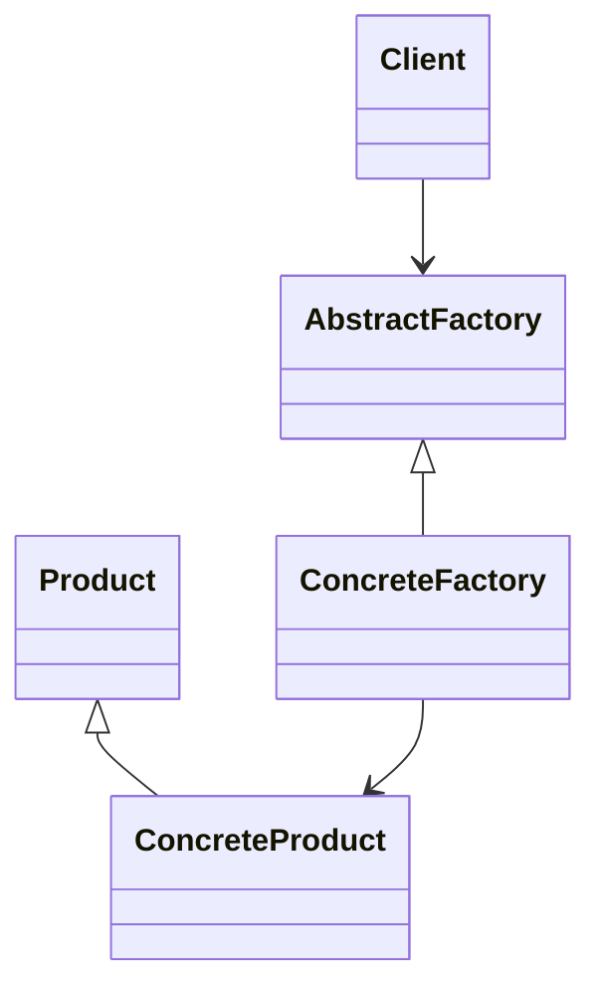

# Creational Patterns

## Definition

Creational patterns deal with **object creation mechanisms**, abstracting the instantiation process.

They decouple **how objects are created** from **how they are used**.

---

## Intent

- Control object creation
- Hide instantiation logic
- Improve flexibility in object creation
- Reduce tight coupling to concrete classes

---

## Core Patterns

- Singleton  
- Factory Method  
- Abstract Factory  
- Builder  
- Prototype  

---

## Structural View

## Architectural Interpretation
- Object creation is `delegated`, not hard-coded.
- Systerm becomes `configuration-driven` rather than constructor-driven.
- It follow `Open/Close Principle.`
-----