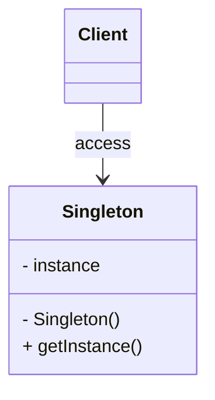
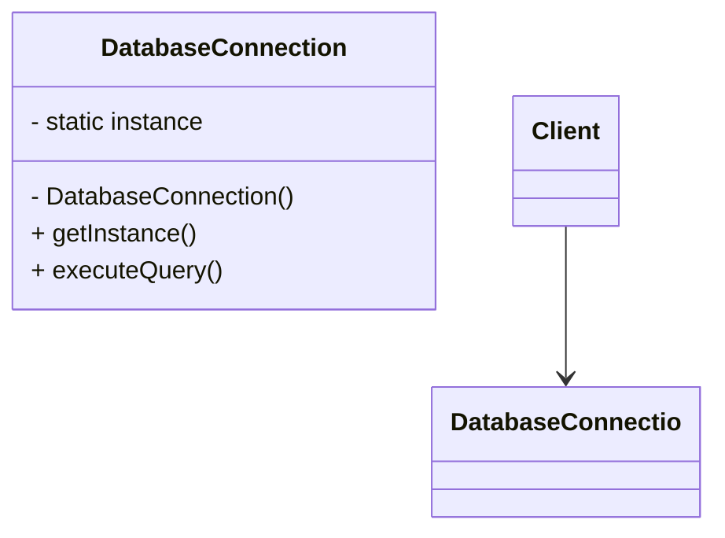
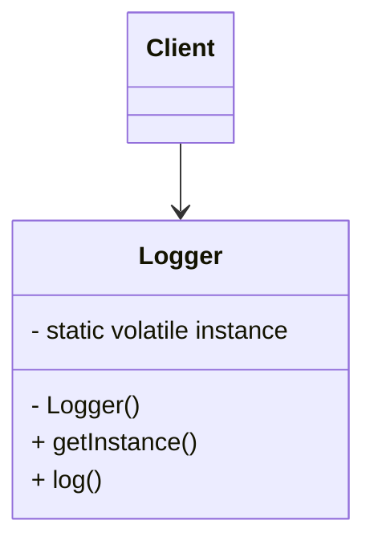
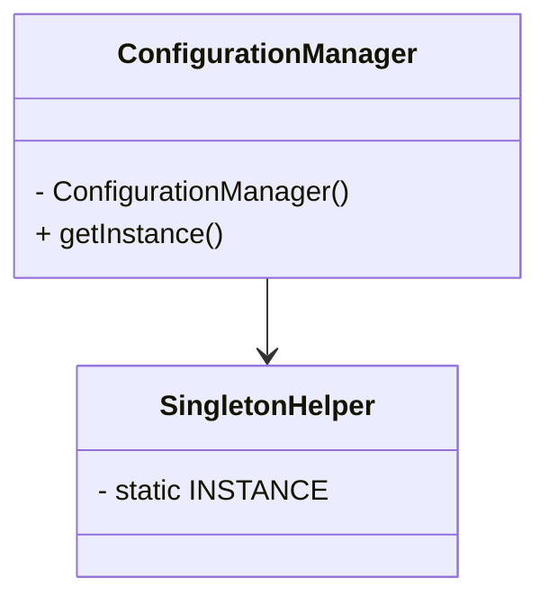
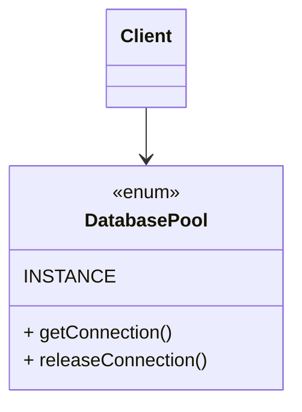
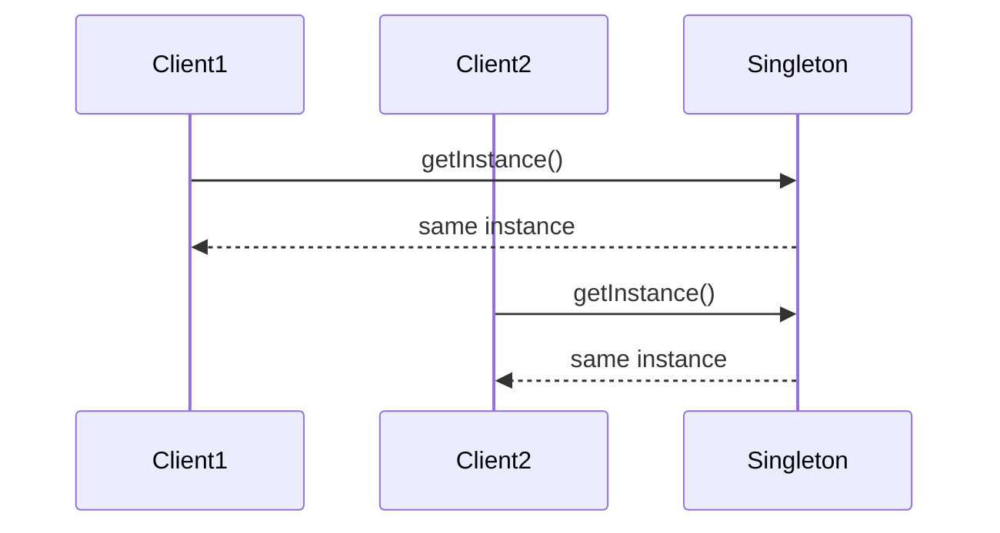

# Singleton Pattern

Singleton ensures that a class has **exactly one instance** and provides a **global access point** to it.

This document focuses on **instantiation control, access patterns, and architectural implications**.

* * *

# Definition

Singleton restricts object creation such that:

- Only one instance exists across the application
- That instance is globally accessible

It combines **controlled instantiation + global access**.

* * *

# Use Cases

- Database connection pool
- Logger
- Configuration manager
- Cache manager
- Thread pool

These are **shared resources** where duplication leads to inconsistency or overhead.

* * *

# When to Use

- Exactly one instance is required
- Shared state must remain consistent
- Centralized control is necessary
- Object creation is expensive

If multiple instances do not break the system, Singleton is unnecessary.

* * *

# Core Structure

Singleton enforces three constraints:

- Private constructor (prevents external instantiation)
- Static instance reference
- Public access method

* * *

## Structural View



# Approach 1 - Eager Initialization

## Structural Model



## Interpretation

- instance is created at class loading time.
- Simple and inhertently Thread-safe
- No synchronization overhead.

## Constraint

- Instance is created even if never used
- Not suitable for expensive object with low usage.

* * *

# Approach 2 - Lazy Initialization

## Structural Model


## Interpretation

- instance is created when `getInstance()` called.
- Simple but not Thread-safe
- need to sychronized the instance object for thread safe

## Constraint

- Instance is created when it's created.
- Not suitable for expensive object with low usage.

* * *

# Approach 3 - Lazy Intialization (Double-Checked Locking)

## Structural Model



## Interpretation

- Instance created only when required
- Double-check reduces synchronization overhead.
- Requires volatile for memory visibility

## Constraint

- More complex implementations.
- Subtle concurrency issue if implemented incorrectly.

* * *

# Approach 4 - Bill Pugh (Initialization-on-Demand Holder)

### Structural Model



### Interpretation

- Uses class loader guarantees.
- Lazy initialization without synchronization.
- Clean and efficient.

### Constraint

- Less intuitive to beginners.
- Relies on JVM class loading behaviour.

* * *

# Approach 5 - Enum Singleton

### Structural Model



### Interpretation

- Single instance guaranteed by language
- Safe against reflection and serialization attacks
- Simplest and most robust implementation

### Constraint

- Less flexible
- Cannot extend other classes

* * *

# Behavioral Perspective



# Design Implications

## Advantages

- Controlled access to shared resource
- Lazy initialization (in specific approaches)
- Reduced memory footprint
- Global coordination point

## Trade-offs

- Hidden dependencies across system
- Difficult to mock or test
- Violates Single Responsibility Principle
- Introduces global state

* * *

# Design Interpretation

Singleton represents:

- Controlled instantiation
- Shared state management
- Global coordination

Singleton does NOT represent:

- Good default design
- Replacement for dependency injection
- Scalable architecture

&nbsp;

----
# Breaking Singleton Pattern

#### Problem: Reflection Attack

java

```java
public class SingletonBreaker {
    public static void main(String[] args) throws Exception {
        // Normal instance
        Logger instance1 = Logger.getInstance();
        
        // Break using reflection
        Constructor<Logger> constructor = Logger.class.getDeclaredConstructor();
        constructor.setAccessible(true);
        Logger instance2 = constructor.newInstance();
        
        System.out.println("instance1 == instance2: " + (instance1 == instance2)); // false!
        }

}
```

#### Solution: Prevent Reflection Attack

java

```java
public class ReflectionProofSingleton {
    private static ReflectionProofSingleton instance;
    
    private ReflectionProofSingleton() {g
        // Prevent reflection attack
        if (instance != null) {
            throw new RuntimeException("Use getInstance() method to create instance");
        }
        System.out.println("Singleton instance created");
    }
    
    public static synchronized ReflectionProofSingleton getInstance() {
        if (instance == null) {
            instance = new ReflectionProofSingleton();
        }
        return instance;
        }

}
```

* * *

# Final Words

- Singleton is often overused because it is easy, not because it is correct.
- In distributed or scalable systems, Singleton rarely holds true beyond process boundaries.
- Many problems solved using Singleton are better handled using **dependency injection or scoped instances**.
- If your design depends heavily on Singleton, it is usually compensating for poor object lifecycle management.
- Treat Singleton as a **constraint-driven decision**, not a convenience tool.

Singleton solves **control**, but often at the cost of **flexibility**

`Real Worl Use Cases`
- Cache Manager
- Thread Pool Manager

### Singleton Pattern Summary

| Approach | Thread-Safe | Lazy | Performance | Complexity | Recommended |
| --- | --- | --- | --- | --- | --- |
| Eager | Yes | No  | Good | Low | Basic cases |
| Lazy (Double-Check) | Yes | Yes | Good | High | Legacy code |
| Bill Pugh | Yes | Yes | Excellent | Low | **Best Practice** |
| Enum | Yes | No  | Excellent | Lowest | Simple cases |