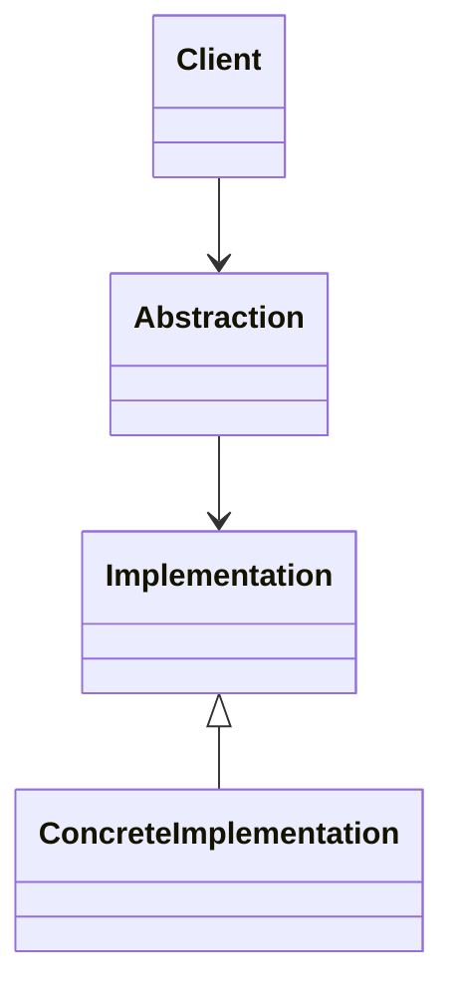

# Structural Patterns

## Definition

Structural patterns deal with **composition of classes and objects**, to form larger systems.

They define how entities are **assembled and related.**

---

## Intent

- Simplify complex structure
- Improve flexibility in object composition
- Enable scalable relationships
- Hide structural complexity

---

## Core Patterns

- Adapter
- Bridge
- Decorator
- Facade
- Composite
- Flyweight
- Proxy

---

## Structural View

## Architectural Interpretation
- Focus on `Object relationship`.
- Reduce `tight coupling between components`.
- Enable `Layered and modular architecture`.
-----