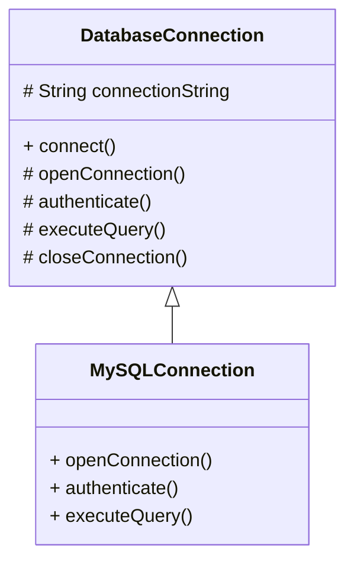
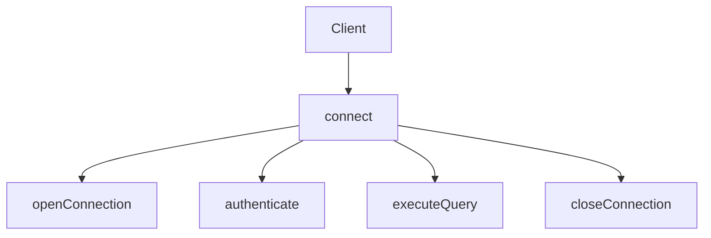
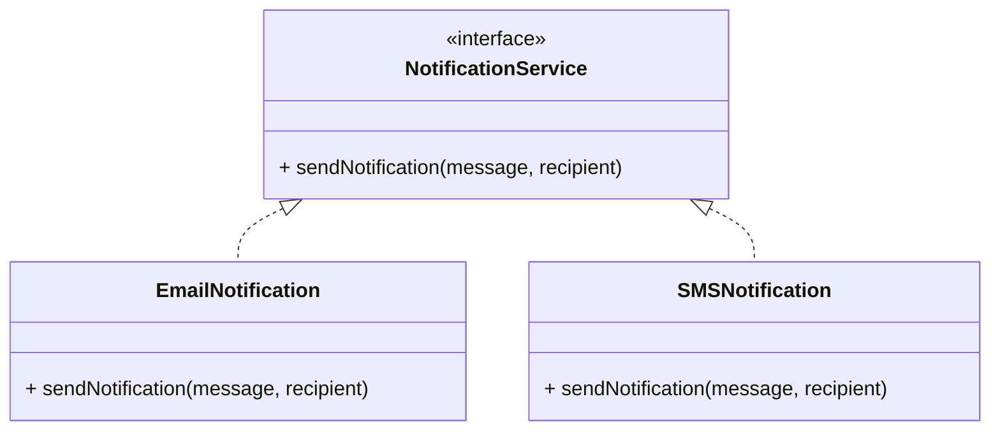
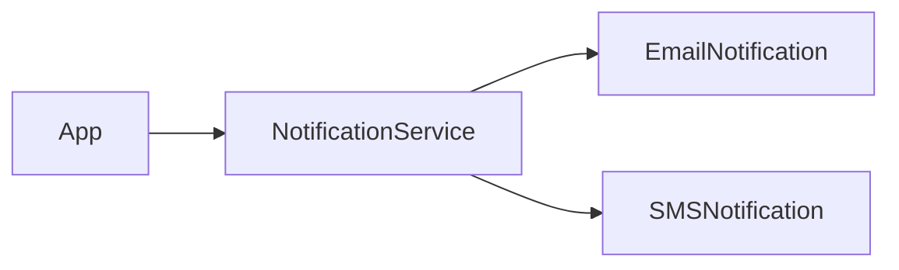
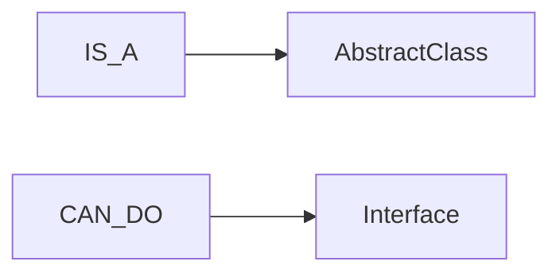

# Object-Oriented Programming (OOP) – Abstraction

## Definition
Abstraction hides **complex implementation details** and exposes only **essential behavior**.  
Consumers know *what* to do, not *how* it is done.

---

## Use Case
- Database connection management
- Notification systems (Email, SMS, etc.)

---

## Abstraction Using Abstract Class  
### (Template Method Pattern)

### Class Structure

***
**Execution Flow (Template Method)**

**Key Facts**
- connect() defines the algorithm
- Subclasses fill in the details
- Order is fixed and enforced
- This is controlled extensibility

**Why Abstract Class Is Used Here**

-  Shared state (connectionString)
- Shared behavior (closeConnection)
-  Enforced workflow (final connect())

  ***
	## Abstraction using Interface
	### (Capability-Based Design)

	### Interface Structure

 **Key Facts**
- No state
- No implementation assumptions
- Pure behavior contract
- Maximum flexibility
***
  ## Abstract Class vs Interface

| Aspect                | Abstract Class | Interface           |
| --------------------- | -------------- | ------------------- |
| Fields                | Yes            | No (constants only) |
| Constructors          | Yes            | No                  |
| Method Implementation | Yes            | Default only        |
| Multiple Inheritance  | No             | Yes                 |
| Use Case              | IS-A           | CAN-DO              |
