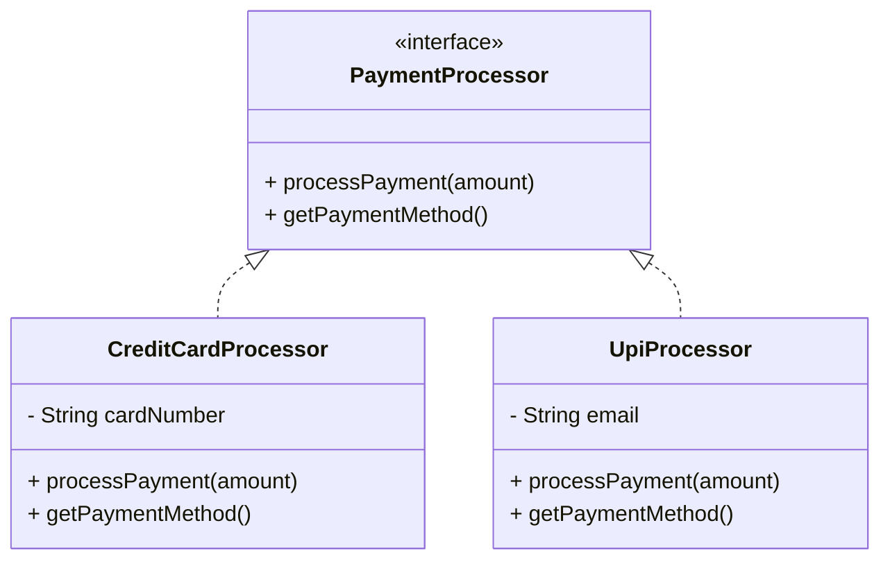
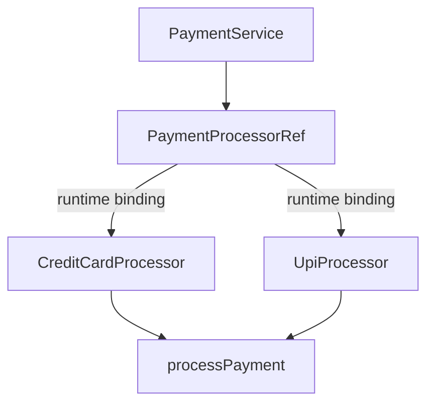
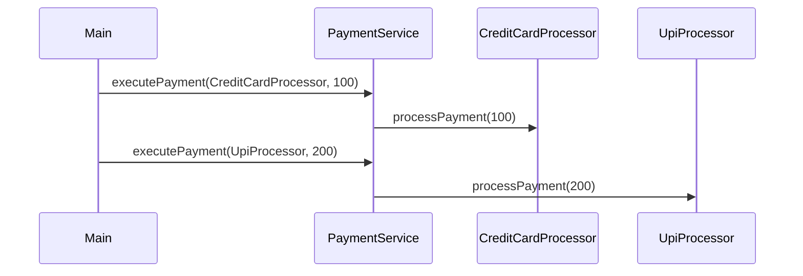
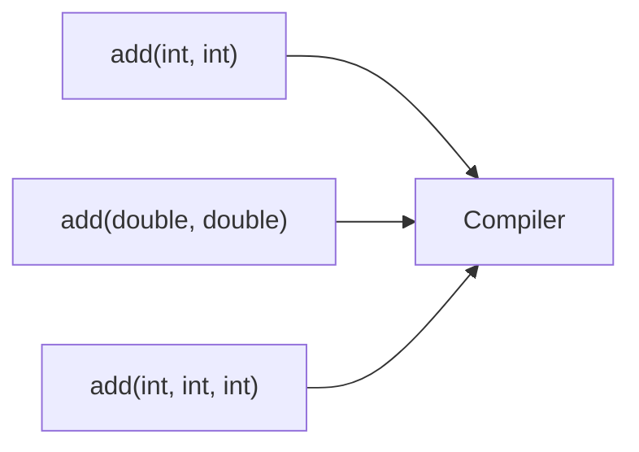

# Object-Oriented Programming (OOP) – Polymorphism

## Definition
Polymorphism is the ability of objects to take **multiple forms**.  
One interface or base type, **multiple implementations**.

Same method call.  
Different runtime behavior.

---

## Types of Polymorphism

- **Compile-time Polymorphism** → Method Overloading
- **Runtime Polymorphism** → Method Overriding

---

## Use Case
Payment processing system supporting multiple payment methods  
(Credit Card, Upi, etc.)

---

## Runtime Polymorphism (Overriding | Interface-Based)

### Class & Interface Structure

# **Runtime Dispatch (what actully happens)**

Important-
1. `PaymentService` depends on interface not on concrete class
2. Behaviour is decided on Runtime

-----

***
# Compile Time Polymorphism (Overloading)
**Method resolution at Compile TIme**

- Same method name

- Different parameter lists

- Decision made at compile time

- No inheritance required
***
| Concept                   | Code Element                       |
| ------------------------- | ---------------------------------- |
| Interface                 | `PaymentProcessor`                 |
| Runtime Polymorphism      | `processPayment()` override        |
| Compile-time Polymorphism | `Calculator.add()` overloads       |
| Loose Coupling            | `executePayment(PaymentProcessor)` |

