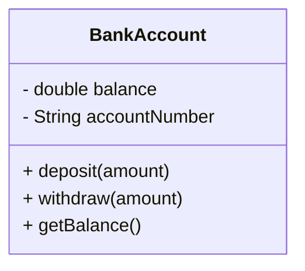
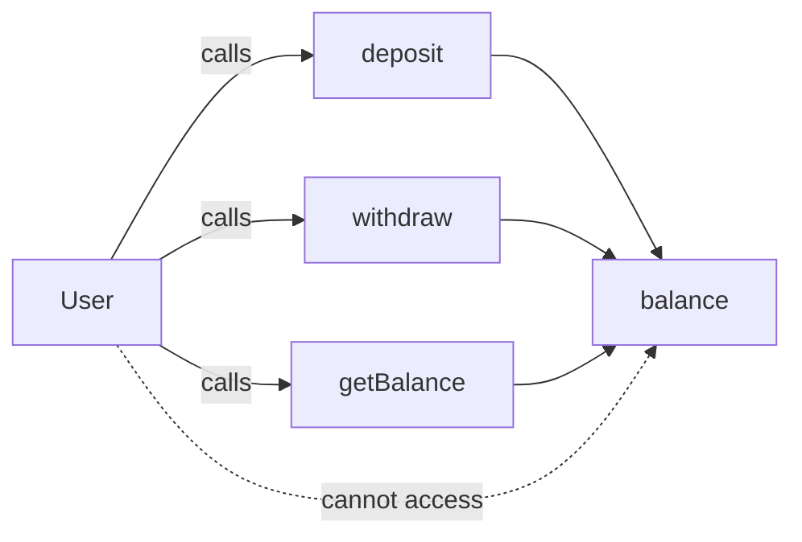
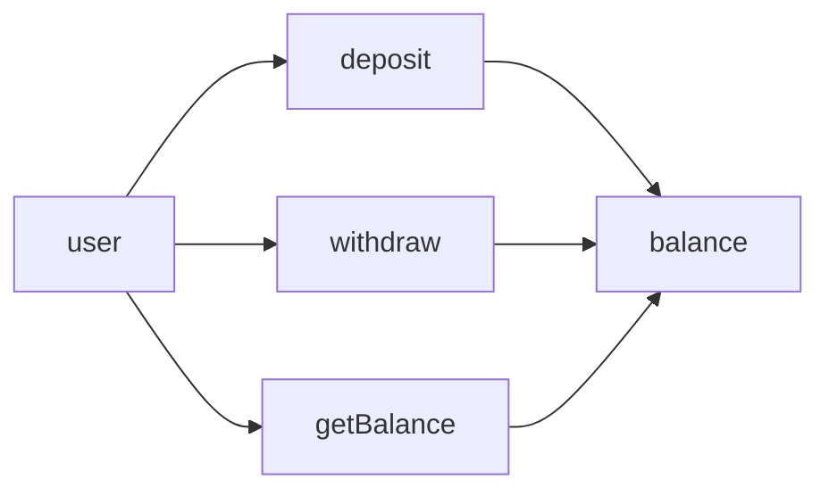

# Object-Oriented Programming (OOP) – Encapsulation

## 1. Encapsulation

### Definition

**Bundling data (attributes) and methods that operate on that data within a single unit (class), and hiding internal details.**

Encapsulation means **hiding internal state** and **forcing controlled access** through methods.  
Direct access to sensitive data is blocked by design.

---

## Class-Level View

