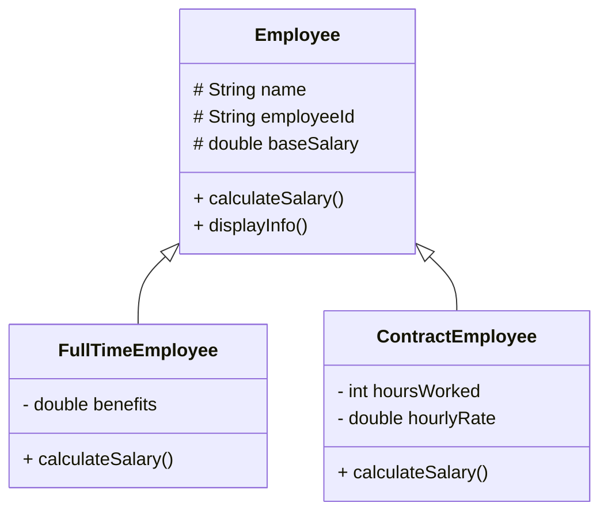
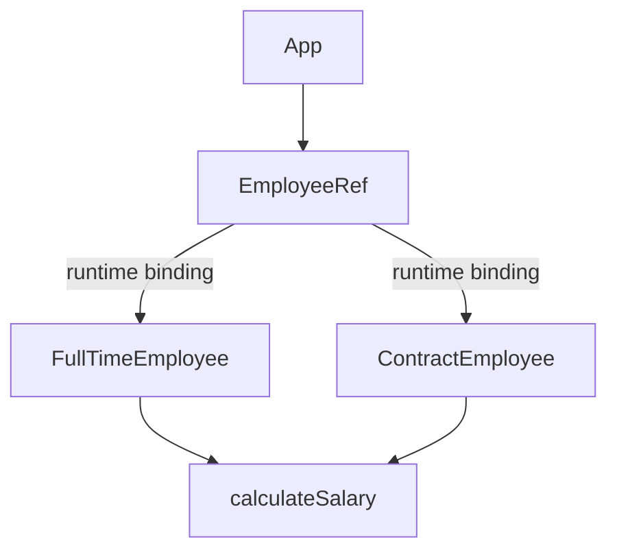
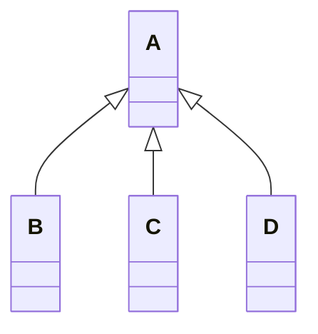
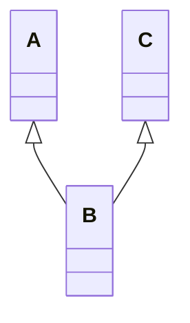

# Object-Oriented Programming (OOP) – Inheritance

## Definition
Inheritance is a mechanism where a new class **derives properties and behaviors** from an existing class.  
It enables **code reuse**, **polymorphism**, and **clear hierarchies**.

---

## Use Case
Employee management system with different employee types sharing common attributes and behavior.

---

## Class Hierarchy (Inheritance Structure)

**Runtime behaviour**

-----

# Types

**Single Inheritance**

**Multilevel Inheritance**

**Hierarchical Inheritance**

**Multiple Inheritance** - Not supported by java

*Note - Diamond ambiguity problem (Used Interface for this)