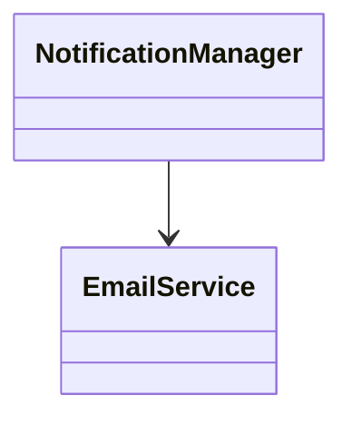
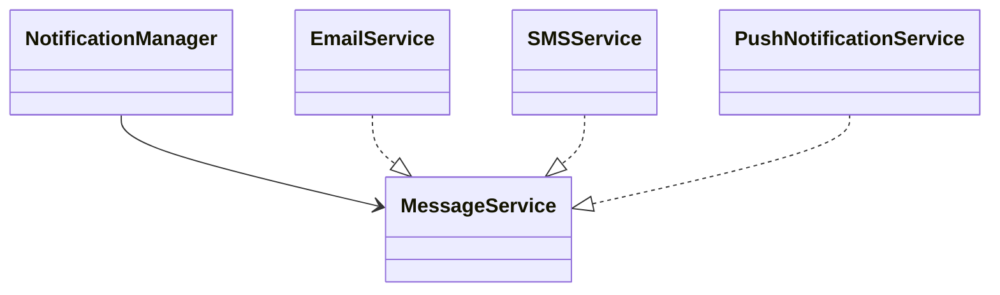

# Dependency Inversion Principle (DIP)

## Definition

High-level modules must not depend on low-level modules.  
Both must depend on abstractions.  

Abstractions must not depend on details.  
Details must depend on abstractions.

---

## Why This Principle Exists

Direct dependency from orchestration logic to concrete implementations creates:

- Tight coupling
- Rigid architecture
- Poor testability
- Difficult extensibility
- Fragile production systems

When high-level policy depends on low-level implementation, any infrastructure change forces modification of business logic. This violates architectural stability.

DIP exists to separate **policy** from **mechanism**.

---

## Core Concept

Architectural direction of dependency must point **inward toward abstractions**, not outward toward concrete implementations.

High-level modules define required behavior through interfaces.  
Low-level modules implement those interfaces.

The ownership of abstraction belongs to the high-level policy layer.

Dependency flow is inverted relative to traditional layered dependency.

---

## Bad Design (Without Applying It)

### Explanation

`NotificationManager` directly creates and depends on `EmailService`.

- High-level policy knows infrastructure detail.
- Switching to SMS or Push requires modifying business logic.
- Violates Open/Closed Principle.
- Breaks test isolation.

### Diagram

### Architectural Flow
- Direct Instantiation
- Concreate Dependency
-  Infrastructure leak into policy layer
-  No abstraction boundary
****
## Good Code
### Explanation 
`NotificationManager` depends on `ManagerService` abstraction.
Concrete services implements the abstraction.
Dependency is injected from outside.

High-level policy is isolated from infrastructure changes.

### Diagram

### Dependency Direction
- High-level → Abstraction
- Low-level → Abstraction
****

## Design Rules
- High-level modules define required interfaces.
- Never instantiate concrete dependencies inside business logic.
- Use constructor injection as default strategy.
- Interfaces must represent behavior, not implementation details.
- Infrastructure layers implement abstractions defined by policy layers.
- Avoid framework-driven abstractions; define domain-owned contracts.
****
## Common Mistakes
- Creating interfaces for every class without architectural need.
- Placing interfaces in the infrastructure layer.
- Using DIP only for test mocking.
- Injecting service locators instead of real abstractions.
- Leaking framework types into business interfaces.
- Over-abstracting prematurely without variation.
****
## Relationship with Other Design Principles
**Open/Closed Principle (OCP)**
DIP enables extension without modification.

**Single Responsibility Principle (SRP)**
Separates policy from infrastructure responsibility.

**Liskov Substitution Principle (LSP)**
Ensures concrete implementations can replace abstractions safely.

**Clean Architecture**
DIP enforces inward dependency flow toward core business rules.

It is the structural backbone of layered and hexagonal architectures.
****

