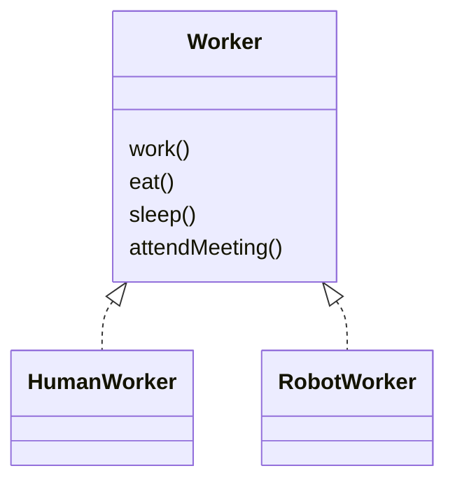
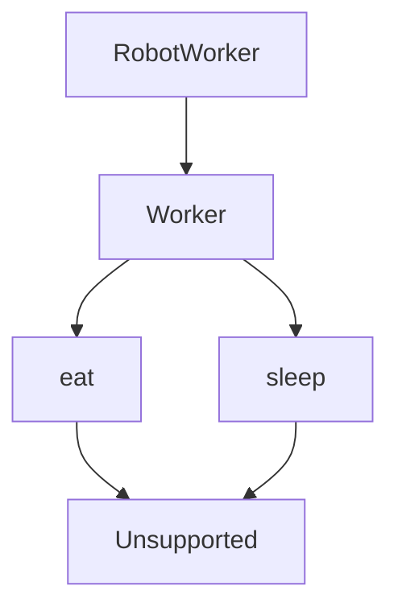
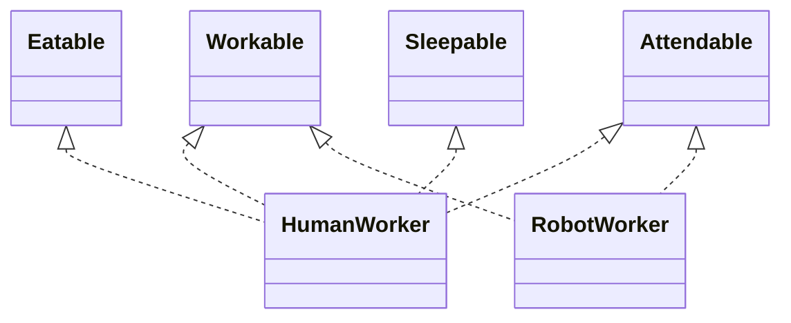
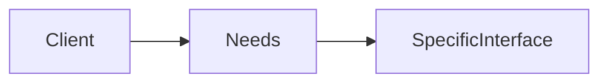
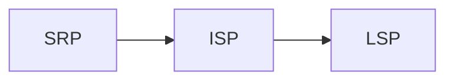

# SOLID Principles – Interface Segregation Principle (ISP)

---

## Definition

**Interface Segregation Principle (ISP)** states:

> **Clients should not be forced to depend on interfaces they do not use.**

In simpler terms:
- Do not make a client depend on behavior it does not need
- Do not bundle unrelated responsibilities into one interface

---

## Simple Explanation

ISP is about **respecting the client’s needs**.

If a client only needs:
- One capability

But is forced to depend on:
- Many unrelated capabilities

Then the design is wrong.

> **Fat interfaces create fragile systems.**

---

## The Core Question Behind ISP

I don’t ask:
> “Is this interface reused?”

I ask:
> **“Who depends on this interface, and what do they actually need?”**

If different clients need **different subsets**, ISP is violated.

---

## ❌ Bad Design — Fat Interface (ISP Violated)

### Conceptual Design

**What This Design Assumes (Which is Wrongly)**
- Every Worker can do everything
-  All clients need all behaviours
-  one interface fits all

**What's actually wrong here**

**First of All : `The Robot`**
- it's depends on behaviour that make no sense (like eat, sleep)
- Must either fake them or throw errors( fake implementation or saying unsupported method)
- Is tightly coupled to irrelevant changes( tightly coupleness is ISP forbids.)

****
## The Real Problem
This issue is not about **Human worker vs Robot worker.**
> One Interface represents multiple responsibilties.

When a interface are fat:
- Client become tightly coupled
- Changes ripples unnecessarily
- Testing becomes harder
- LSP violations start appearing

****

## ✅Good Design : Segreted Interface

### Design Shift
> **Split interfaces by capability, not by “entity”.**

### How The Design Looks Now

**Now**
- Each interface represents one capability
- Clients depend only on what they actually use
****
## Why This Design Works

**ISP Is About Interfaces, Not Just interface**
Important: ISP applies to

- Interfaces
- Abstract classes
- Service contracts
- APIs

Any contract that forces unnecessary dependency violates ISP.

****
## Relationship with Other SOLID Principles
- SRP → one reason to change
- ISP → one reason to depend
- LSP → safe substitution
- OCP → safe extension

****
### Final words
> Design interfaces from the client’s point of view, not the implementer’s convenience.

The problem is not **too many method**
The problem is **multiple responsibility bundled into single interface**
Here is the **SRP violates** at interface level, and **ISP is the fix.**
