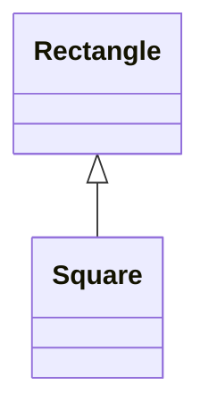
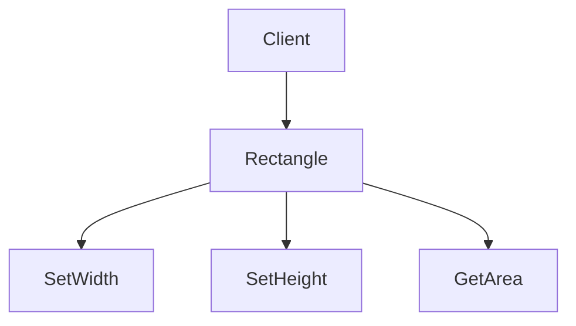
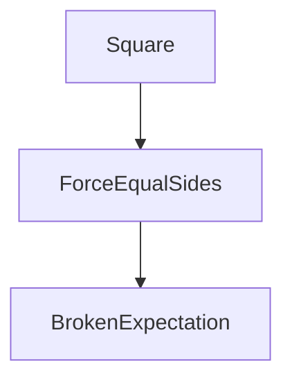
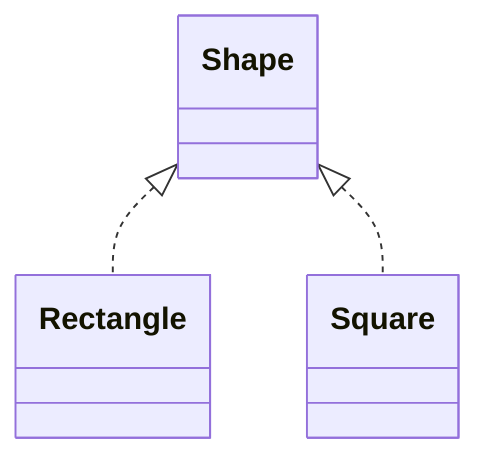
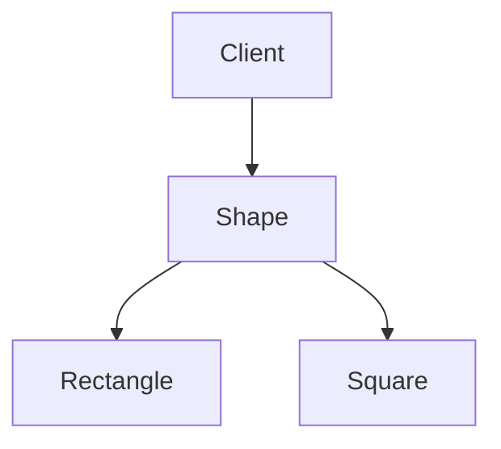
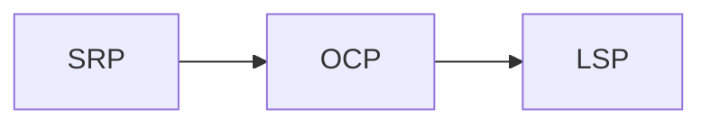
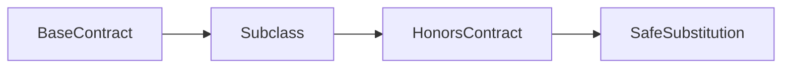

# SOLID Principles – Liskov Substitution Principle (LSP)

---

## Definition (Start Simple)

**Liskov Substitution Principle (LSP)** states:

> Objects of a base type should be replaceable with objects of its subtypes **without breaking the correctness of the system**.

In simple words:
- If `A` is a subtype of `B`
- Then anywhere `B` is expected, `A` should work **without surprises**

---

## Plain-English Explanation

LSP is about **trust**.

When code accepts a base type, it **trusts** certain behaviors:
- Inputs behave as expected
- Outputs make sense
- Rules are not secretly changed

If a subclass **changes the rules**, substitution breaks.

That is an LSP violation.

---

## The Key Question Behind LSP

I don’t ask:
> “Does this use inheritance correctly?”

I ask:
> **“Can I replace the parent with the child and still sleep peacefully?”**

If behavior changes in unexpected ways → LSP is broken.

---

## Use Case (Conceptual)

We have:
- A general concept: **Shape**
- A function that calculates area
- The function assumes **consistent behavior**

The danger appears when:
- A subtype looks compatible
- But behaves differently under the hood

---

## ❌ Bad Design — LSP Violated (Rectangle / Square)

### How the Design Looks

**At first glance**
- A square is a rectangle (mathematically), so inheritance feels reasonable.
- but LSP is not about mathematics, it about behavioural contract.

## Hidden Beahavioural Assumption

**The client assumes:**
- Width and Height can change independently
- Area reflect those independent changes

**What the Square Breaks**

**By forcing:**
`
width = height
`

### The square:
- Violates the expectations of Rectangle
- Changes the meaning of inherited behavior

****
## The Real Problem (Important Insight)
The problem is not Square vs Rectangle.
The real problem is:
> The base class exposes behaviors that subclasses cannot honor safely.

Inheritance was chosen where behavioral compatibility did not exist.
****
## ✅ Good Design — LSP Respected
**Design Shift**

Instead of:
- Forcing a wrong inheritance hierarchy

We do this:
- Depend on what the client actually needs

Correct Conceptual Design

**Now:**
- No behavioral promises are broken
- Each shape defines its own area logic
- The client depends only on getArea

**Client Perspective (This Is Key)**

**The client:**
- Does not care how area is calculated
- Only cares that it is correct

This design respects LSP.
****
## Relationship with SRP and OCP
- **SRP** → separates responsibilities
- **OCP** → controls where change happens
- **LSP** → ensures extensions remain correct

**Without LSP, OCP extensions silently break systems.**
****
## Understanding & Rantionale
**Mental Model (Memorize This)**

### Final words
> **If a subclass forces the client to “know the difference”, LSP is broken.**