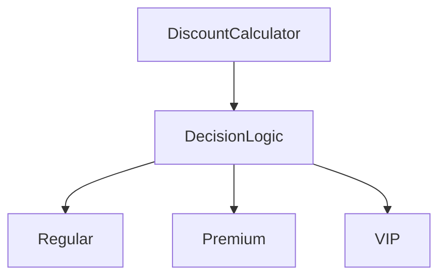
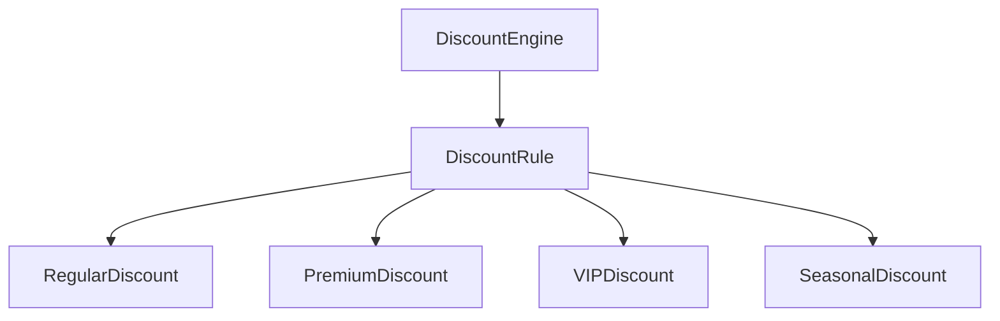
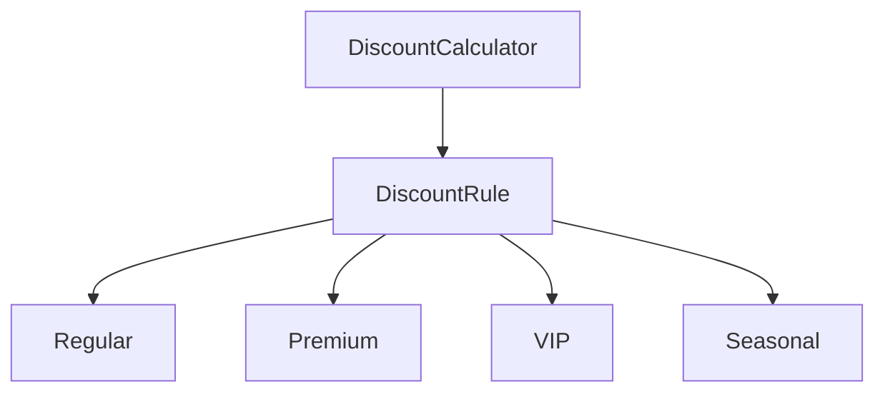
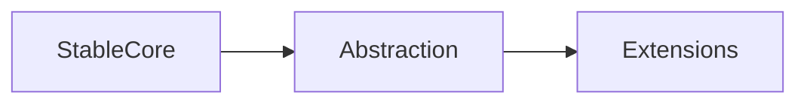
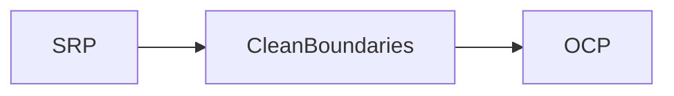
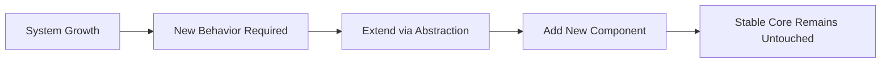

# SOLID Principles – Open/Closed Principle (OCP)

---

# 1. Definition 

**Open/Closed Principle (OCP)** states:

> **Software entities (classes, modules, services) should be open for extension but closed for modification.**

This means:
- You should be able to **add new behavior**
- **Without changing existing, tested code**

---

# 2. Plain-English Explanation

In real projects:
- Requirements keep changing
- New cases keep getting added
- Old logic usually already works

OCP says:

> “When something new is needed, don’t touch what already works.  
> Extend the system instead.”

Why?
Because modifying existing code is where **bugs and regressions** come from.

---

## 3. The Core Idea Behind OCP

OCP separates code into two categories:

| Category | Meaning |
|---|---|
| **Stable code** | Rarely changes, business-critical |
| **Volatile code** | Changes frequently, business rules |

**OCP protects stable code from volatile changes.**

---

#  4. ❌ OCP Violation – Centralized Logic (Bad Design)

### Design Smell: Conditional-Based Behavior

**Why this violates OCP**
-  Every new case requieres modifyfing `DecisionLogic`.
-   Existing logic must be retested.
-   Risk increases as System grows.

The design Forces **Modification not Extension**

### Why this is a Problem
Each new discount causes:
- Modification of existing logic
-  Retesting of all previous cases
-  Higher chances of breaking something that already works
### What happens overtime (reality check)

****

# 5. ✅Good Design - OCP applied correctly
### core design idea
> seprate stable logic from new changes

**System Designed**

### what does this design means
- The core engine never changes
-  Each discount rule is isolated
-   New discount are added, not inserted
## Compilant design - Extension over Modification

**How this follow OCP**
- Core logic never changes
- New behaviour added as new Extension
- Old code remains untouched

## "Open" vs "Closed"
❌ Common Misunderstanding
- "Closed means no new code"

✅ Correct Meaning
- Closed for Modification - Existing logic not changed
- Open for Extension - New behaviour added externally

***
## How OCP is actully achieved (conceptually)
**OCP enabled by**
- Abstraction
- Contract
- Extension Point

****
### Relationship with SRP
- ***SRP** decides what belongs together*
- ***OCP** decides how growth heppens*

Without SRP, OCP collapses.
Without OCP, SRP boundaries get violated repeatedly.

# Understanding & Rationale

## What OCP Really Means

**Open/Closed Principle (OCP)** states that software entities should be **open for extension but closed for modification**.

This does **not** mean:
- Never changing existing code
- Adding abstractions everywhere
- Predicting future requirements

OCP is about **protecting stable, high-risk code paths** from frequent change.

The real objective is **change isolation**, not theoretical purity.

---

## When NOT to Apply OCP

Do **NOT** force OCP when:

- **Requirements are unstable**  
  Early abstractions will be wrong and rewritten.

- **No real variation exists**  
  One behavior does not justify polymorphism.

- **You are guessing future needs**  
  “We might need this later” is not a requirement.

**Premature OCP leads to overengineering**:
- Extra indirection
- Higher cognitive load
- Slower development
- No real risk reduction

---

## Correct Mental Model (Memorize This)

### Final Words
- **OCP is not about avoiding changes**
-  **It is about deciding where to make changes**
***