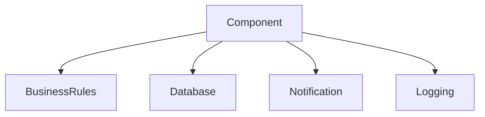
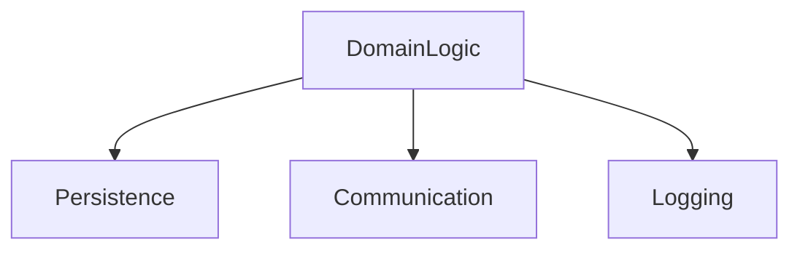
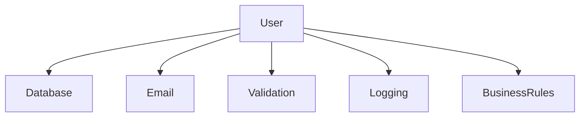
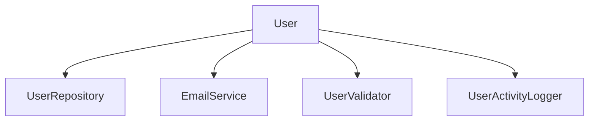

# SOLID — Single Responsibility Principle (SRP)
## Definition
 A class should have **only one reason to change**, meaning it should have **only one job or responsibility**.

---

## What SRP  is Trying to Solve (Big Picture)
 SRP is not about writing good or clean code

>  Software keeps changing, and change is expensive when design is wrong

---

## What SRP Actually Protects You From

SRP is not about cleanliness.  
SRP is about **containing damage**.

Every system changes.
SRP determines **how far the damage spreads** when it does.

If you remember only one thing:
> SRP limits the blast radius of change.

---

## What SRP Actually Means (Beyond the Definition)

> “A class should have only one reason to change.”

**Most people misunderstand this.**

❌ Wrong interpretation

***“One class should do only one thing.”***

✅ Correct interpretation

***“One class should change for one kind of reason, driven by one kind of stakeholder or concern.”***

Responsibility = reason for change, not functionality.

---

## Responsibility = Axis of Change (Non-Negotiable)

A responsibility is **not a task**.  
It is **a reason the design must change**.

Typical axes of change:
- Business policy
- Persistence / storage
- Communication (Notification, SMS, push)
- Security / authorization
- Auditing / logging
- Formatting / presentation
- External integrations

If a single unit is pulled by **more than one axis**, SRP is violated.

---

## SRP at the Design Level (Before Code Exists)

### SRP Violation (Classic)

**This component will change when:**
- Business rule change
- Database changes
- Notification provider changes
- Audit rules changes

***
## SRP-Compilant Design

**Now this make impact the change like:**
- Business rules change → DomainLogic
- DB changes → Persistence
- Notification changes → Communication
- Audit rules change → Logging

---
## Understanding of Bad Example (Design Failure)

When ony class has **all the responsibilties** 
- Representing user data
- Talking to the database
- Sending emails
- Validating input
- Logging activity

| Change Request          | Who triggers it         |
| ----------------------- | ----------------------- |
| Database schema change  | DB / Infra team         |
| Email provider change   | Communication / Product |
| Validation rules update | Business                |
| Logging format update   | Compliance / Ops        |

---
## Desing view of Bad Example

This is a **God Class**

It will:
- Break Often
- Hard to test
- Create fear during changes
- Block refactoring

**Why This Design Fails in Real System**
**when  one responsibilty changes**:
- redeploying unrelated logic
- risk breaking unrelated behaviour
- large Code, fragile tests
- Hesitate to touch the code
---
## Understanding the Good Example (Design Recovery)
**Responsibility are seprated by the reason to change**
| Component          | Reason to Change          |
| ------------------ | ------------------------- |
| User               | User data structure       |
| UserRepository     | Storage strategy          |
| EmailService       | Communication mechanism   |
| UserValidator      | Business validation rules |
| UserActivityLogger | Audit / logging policy    |

Each Unit has **one axis of change**

----

## Design view of Good Example

**Now**
- DB change don't affect Email Logic
- Validation change don't affect persistence
- Logging changes don't affect business rules

**Change is contained.***
***
## Why this is Easy to Test and Maintain
Because Responsibilties are isolated:
- can test validation w/o DB
- can test DB logic w/o mail
- can test business logic w/o logging

Hence Test becomes **Smaller, Faster & More Meaningful**
***
## Understanding & Rationale
when i studied and reaserched about it i think **“SRP is about separating reasons for change.
I apply it by identifying different axes of volatility and isolating them so changes don’t cascade across the system.”**

When developing a project, compromising on the Single Responsibility Principle (SRP) often stems from three common misconceptions. Reframing these mistakes is essential for building resilient software.
***  
| Misconception                     | Professional Reality                                                                 |
|----------------------------------|---------------------------------------------------------------------------------------|
| "This is overengineering."       | Change isolation: SRP is not about complexity; it ensures that a change in one requirement does not break unrelated features. |
| "There are too many classes."    | Decoupling over volume: Classes are computationally cheap to manage. High coupling—where one change ripples through the entire codebase—is the real cost. |
| "I’ll refactor later."           | Technical debt: “Later” usually arrives when the system is already fragile. Proactive design is significantly faster than reactive debugging. |

**Final Words**
- SRP is the foundation of SOLID for a reason
- It limits the blast radius of change
- It improves testability, maintainability, and clarity
- It’s about design boundaries, not Java classes
> If you get SRP right, the rest of SOLID becomes much easier.

----
legit Dictonary:
`Change is contained`: "In software development, the phrase "change is contained" means that modifications to the code, design, or requirements are isolated to a specific module, component, or system, preventing them from creating widespread, unpredictable "ripple effects" or breaking existing functionality elsewhere."

