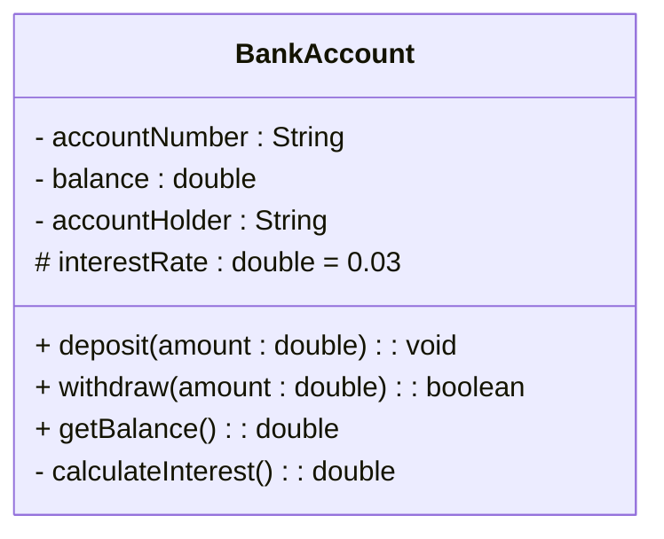
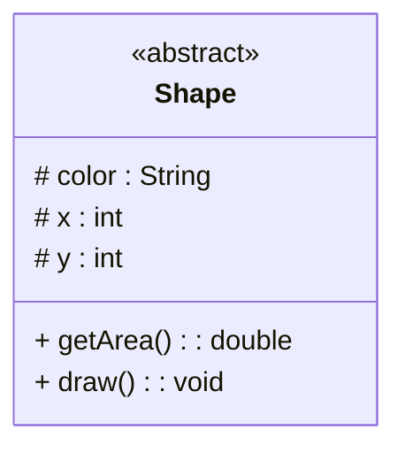
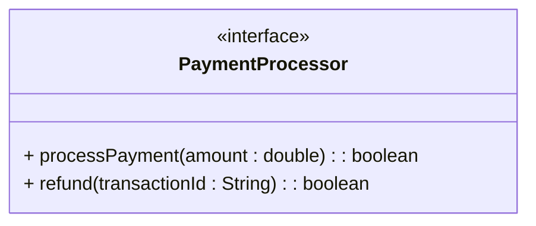

# UML Diagrams - Class Diagram

## Defination
>Shows the static structure of the system - classes, their attributes, methods, and relationships.

A **Class Diagram** represents the static structure of the system:
- Classes
- Methods
- Attributes
- Relationships
- Visibility

When to use:
- Designing a system structure
- showing class Hierarchies
- Documenting existing code
- Pleanning Database schema

```mathematica
┌─────────────────────────────────────┐
│         ClassName                   │  ← Name compartment
├─────────────────────────────────────┤
│ - attribute1: type                  │  ← Attributes compartment
│ + attribute2: type = defaultValue   │
│ # attribute3: type                  │
├─────────────────────────────────────┤
│ + method1(param: type): returnType  │  ← Methods compartment
│ - method2(): void                   │
│ # method3(p1: type, p2: type): type │
└─────────────────────────────────────┘

Visibility communicates encapsulation maturity.
```

### Visibility Symbol
| Symbol | Meaning           |
| ------ | ----------------- |
| +      | Public            |
| -      | Private           |
| #      | Protected         |
| ~      | Package / Default |

### Attribute Syntax
```
visibility name: type [multiplicity] = defaultValue {property}
```
### Example
```
- accountNumber: String
+ balance: double = 0.0
# items: List<Item> [0..*]
+ MAX_SIZE: int = 100 {readOnly}
```

### Method Syntax
```
visibility name(parameter: type, ...): returnType
```
### Example
```
+ deposit(amount: double): void
- calculateInterest(): double
# validateTransaction(tx: Transaction): boolean
+ getInstance(): Singleton {static}
```


---

## UML - Class Diagram Example: BankAccount Class

### UML Representation


## Java Class Representation
```Java
public class BankAccount {
    private String accountNumber;
    private double balance;
    private String accountHolder;
    protected double interestRate = 0.03;

    public void deposit(double amount) {
        balance += amount;
    }

    public boolean withdraw(double amount) {
        if (balance >= amount) {
            balance -= amount;
            return true;
        }
        return false;
    }

    public double getBalance() {
        return balance;
    }

    private double calculateInterest() {
        return balance * interestRate;
    }
}
```
# Special Notation
## Abstract Class Example

## Interface Example


# Stereotype Examples

- «interface»
- «abstract»
- «enumeration»
- «singleton»
- «utility»
- «entity»
- «controller»
- «boundary»

