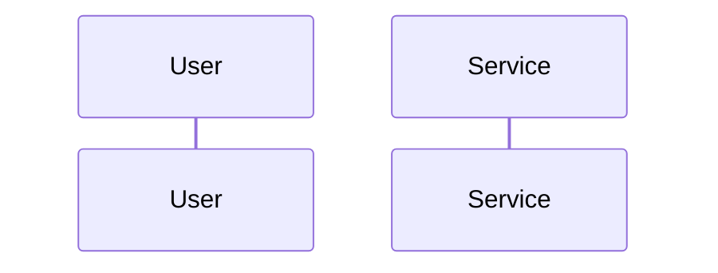
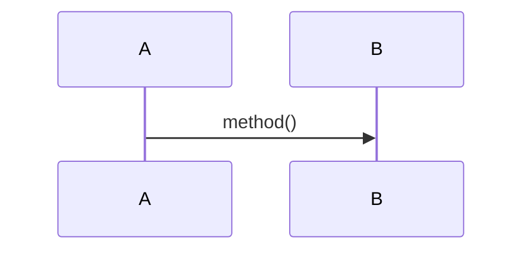
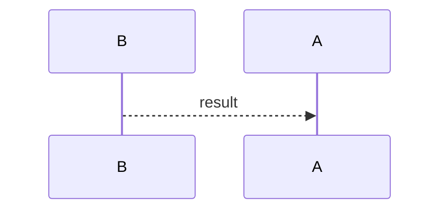
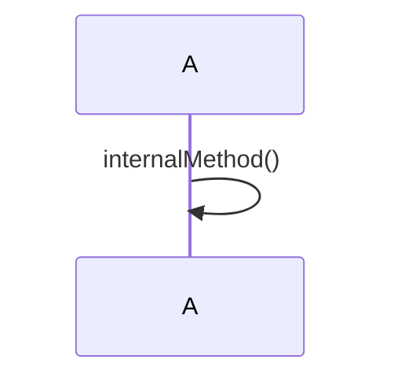
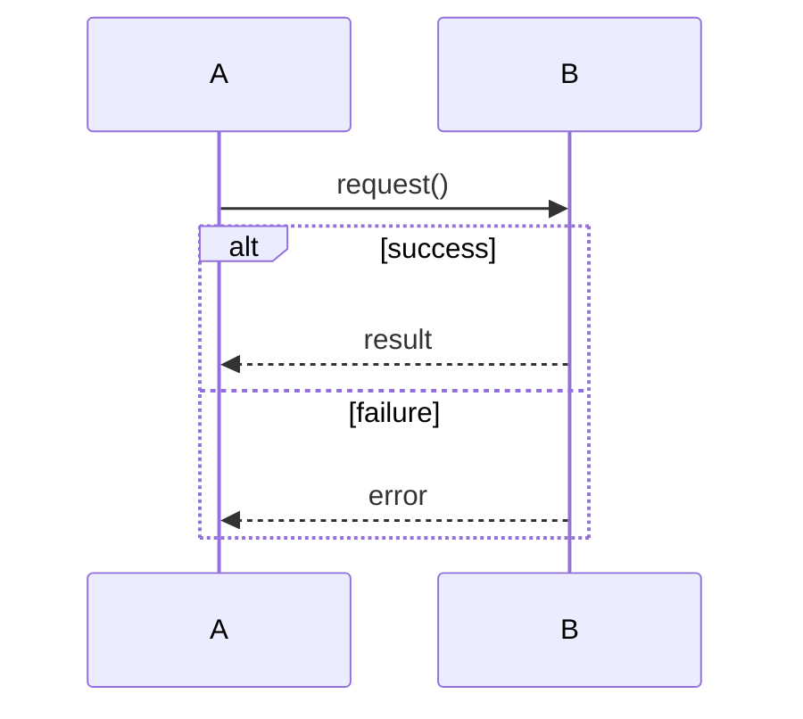
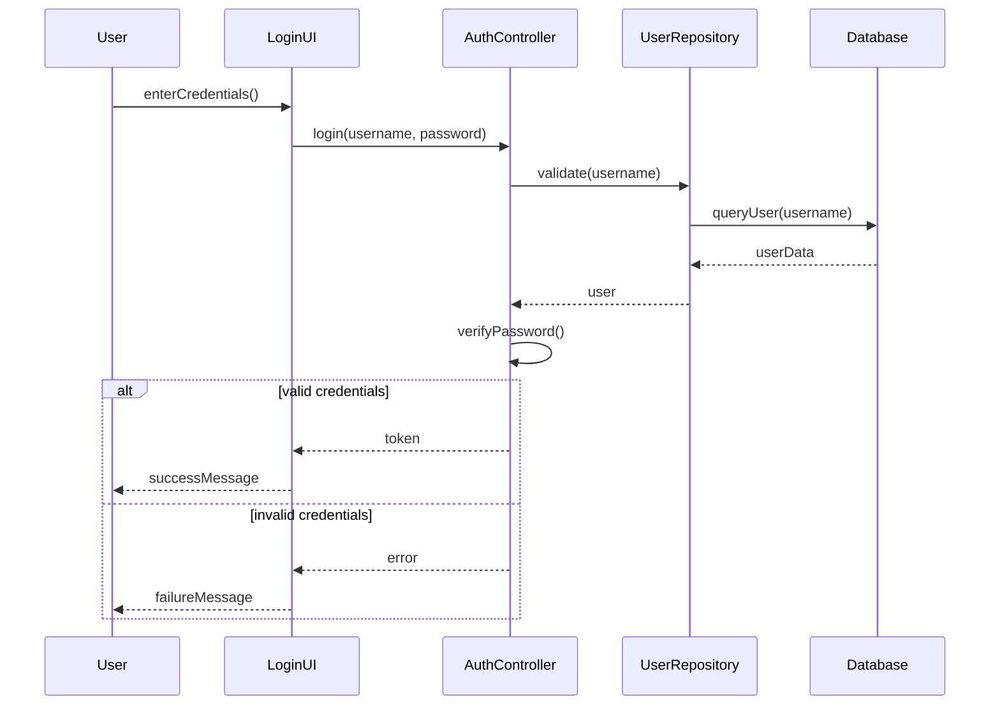
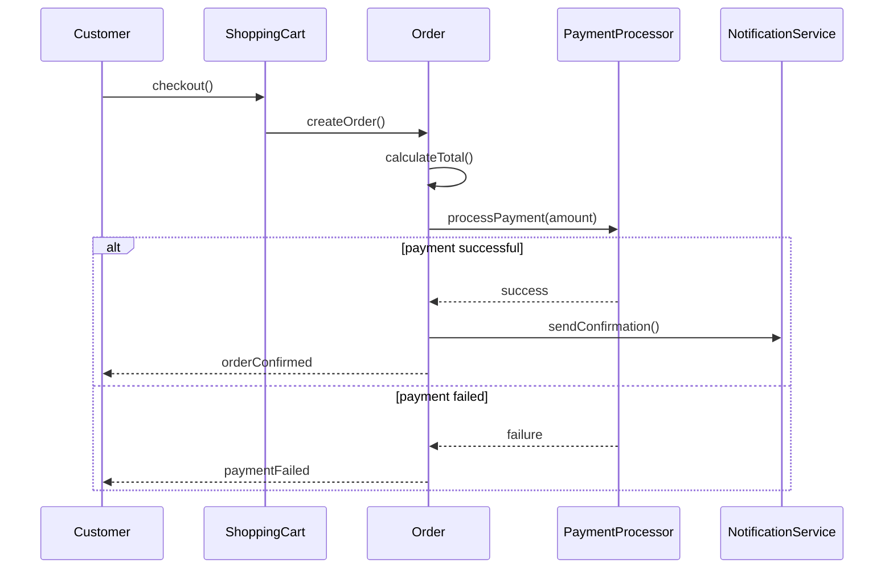

# UML Sequence Diagrams

---

## 1. What is a Sequence Diagram?

A **Sequence Diagram** represents how objects interact over time.

It shows:
- Participants (actors / objects)
- Message flow
- Execution order
- Control logic (if/else, loop)

It answers:

> “What happens when this action is triggered?”

---

## 2. When to Use Sequence Diagrams

Use them for:

- Explaining method call flow
- Describing API interactions
- Demonstrating business processes
- Showing collaboration between components
- Explaining algorithms in interviews

Class Diagram = Structure  
Sequence Diagram = Behavior  

---

## 3. Core Components

### 1️⃣ Participants

Participants can be:
- Actors (external users)
- Services
- Controllers
- Repositories
- Databases


### 2️⃣ Message Types

- **Synchronus Call** wait for response


- **Return** -  Response sent back

- **Self Call** - Object calling its own method


### 3️⃣ Control Block
- `alt` → conditional branching  
- `opt` → optional execution  
- `loop` → repeated execution 



---
# Example
## User Login Flow 

**Scenario**

User attempts to log in with credentials.

---

## Sequence Diagram


## Reference Implementation (Minimal)
```java
// User entity
public class User {
    private String userId;
    private String username;
    private String passwordHash;
    private String email;
    
    // Constructor, getters, setters
    public User(String userId, String username, String passwordHash, String email) {
        this.userId = userId;
        this.username = username;
        this.passwordHash = passwordHash;
        this.email = email;
    }
    
    public String getUserId() { return userId; }
    public String getUsername() { return username; }
    public String getPasswordHash() { return passwordHash; }
}

// Database layer
public class Database {
    private Map<String, User> users = new HashMap<>();
    
    public Database() {
        // Simulate database with some users
        users.put("john_doe", new User("1", "john_doe", "hashed_pass123", "john@email.com"));
    }
    
    public User queryUser(String username) {
        System.out.println("[Database] Querying user: " + username);
        return users.get(username);
    }
}

// Repository layer
public class UserRepository {
    private Database database;
    
    public UserRepository(Database database) {
        this.database = database;
    }
    
    public User validate(String username) {
        System.out.println("[UserRepository] Validating user: " + username);
        return database.queryUser(username);
    }
}

// Controller layer
public class AuthController {
    private UserRepository userRepository;
    
    public AuthController(UserRepository userRepository) {
        this.userRepository = userRepository;
    }
    
    public String login(String username, String password) {
        System.out.println("[AuthController] Processing login for: " + username);
        
        // Step 1: Validate user exists
        User user = userRepository.validate(username);
        
        if (user == null) {
            return null;
        }
        
        // Step 2: Verify password
        if (verifyPassword(password, user.getPasswordHash())) {
            // Step 3: Generate token
            String token = generateToken(user);
            System.out.println("[AuthController] Login successful, token generated");
            return token;
        }
        
        return null;
    }
    
    private boolean verifyPassword(String password, String passwordHash) {
        System.out.println("[AuthController] Verifying password");
        // Simulate password verification
        return ("hashed_" + password).equals(passwordHash);
    }
    
    private String generateToken(User user) {
        return "TOKEN_" + user.getUserId() + "_" + System.currentTimeMillis();
    }
}

// UI layer
public class LoginUI {
    private AuthController authController;
    
    public LoginUI(AuthController authController) {
        this.authController = authController;
    }
    
    public void handleLogin(String username, String password) {
        System.out.println("[LoginUI] Handling login request");
        
        String token = authController.login(username, password);
        
        if (token != null) {
            displaySuccess(token);
        } else {
            displayError();
        }
    }
    
    private void displaySuccess(String token) {
        System.out.println("[LoginUI] Login successful! Token: " + token);
    }
    
    private void displayError() {
        System.out.println("[LoginUI] Login failed! Invalid credentials");
    }
}

// Simulation
public class LoginSequenceDemo {
    public static void main(String[] args) {
        // Setup
        Database database = new Database();
        UserRepository repository = new UserRepository(database);
        AuthController controller = new AuthController(repository);
        LoginUI loginUI = new LoginUI(controller);
        
        // User enters credentials
        System.out.println("=== User Login Sequence ===\n");
        loginUI.handleLogin("john_doe", "pass123");
    }
}
```

---

## Example 2: Online Shopping - Place Order

## Online Shopping – Place Order
**Scenario**
`Customer checks out and completes payment.`

### Sequence Diagram


### Reference Implementation
```java
// Product
public class Product {
    private String productId;
    private String name;
    private double price;
    private int stock;
    
    public Product(String productId, String name, double price, int stock) {
        this.productId = productId;
        this.name = name;
        this.price = price;
        this.stock = stock;
    }
    
    public boolean checkStock(int quantity) {
        System.out.println("[Product] Checking stock for " + name + ": " + stock);
        return stock >= quantity;
    }
    
    public boolean reserveStock(int quantity) {
        if (stock >= quantity) {
            stock -= quantity;
            System.out.println("[Product] Reserved " + quantity + " units of " + name);
            return true;
        }
        return false;
    }
    
    public double getPrice() { return price; }
    public String getName() { return name; }
}

// Shopping Cart
public class ShoppingCart {
    private Map<Product, Integer> items = new HashMap<>();
    
    public void addToCart(Product product, int quantity) {
        System.out.println("[ShoppingCart] Adding to cart: " + product.getName());
        if (product.checkStock(quantity)) {
            items.put(product, quantity);
            System.out.println("[ShoppingCart] Product added successfully");
        } else {
            System.out.println("[ShoppingCart] Product out of stock");
        }
    }
    
    public Order checkout() {
        System.out.println("[ShoppingCart] Processing checkout");
        Order order = new Order();
        
        for (Map.Entry<Product, Integer> entry : items.entrySet()) {
            order.addItem(entry.getKey(), entry.getValue());
        }
        
        items.clear();
        return order;
    }
}

// Order
public class Order {
    private String orderId;
    private List<OrderItem> items = new ArrayList<>();
    private double totalAmount;
    private String status;
    
    public Order() {
        this.orderId = "ORD-" + System.currentTimeMillis();
        this.status = "PENDING";
        System.out.println("[Order] Order created: " + orderId);
    }
    
    public void addItem(Product product, int quantity) {
        if (product.reserveStock(quantity)) {
            items.add(new OrderItem(product, quantity));
            calculateTotal();
        }
    }
    
    private void calculateTotal() {
        System.out.println("[Order] Calculating total");
        totalAmount = items.stream()
                          .mapToDouble(item -> item.getProduct().getPrice() * item.getQuantity())
                          .sum();
        System.out.println("[Order] Total amount: $" + totalAmount);
    }
    
    public boolean processPayment(PaymentProcessor paymentProcessor) {
        System.out.println("[Order] Processing payment");
        boolean success = paymentProcessor.processPayment(totalAmount);
        
        if (success) {
            confirmOrder();
        }
        
        return success;
    }
    
    private void confirmOrder() {
        this.status = "CONFIRMED";
        System.out.println("[Order] Order confirmed: " + orderId);
    }
    
    public void sendNotification(NotificationService notificationService, String recipient) {
        notificationService.sendOrderConfirmation(orderId, recipient);
    }
    
    public String getOrderId() { return orderId; }
    public double getTotalAmount() { return totalAmount; }
    public String getStatus() { return status; }
}

// OrderItem
class OrderItem {
    private Product product;
    private int quantity;
    
    public OrderItem(Product product, int quantity) {
        this.product = product;
        this.quantity = quantity;
    }
    
    public Product getProduct() { return product; }
    public int getQuantity() { return quantity; }
}

// Payment Processor
public interface PaymentProcessor {
    boolean processPayment(double amount);
}

public class CreditCardProcessor implements PaymentProcessor {
    @Override
    public boolean processPayment(double amount) {
        System.out.println("[PaymentProcessor] Processing payment: $" + amount);
        // Simulate payment processing
        System.out.println("[PaymentProcessor] Payment successful");
        return true;
    }
}

// Notification Service
public class NotificationService {
    public void sendOrderConfirmation(String orderId, String recipient) {
        System.out.println("[NotificationService] Sending confirmation email to " + recipient);
        System.out.println("[NotificationService] Order " + orderId + " confirmed");
    }
}

// Customer
public class Customer {
    private String customerId;
    private String name;
    private String email;
    
    public Customer(String customerId, String name, String email) {
        this.customerId = customerId;
        this.name = name;
        this.email = email;
    }
    
    public void placeOrder(ShoppingCart cart, PaymentProcessor paymentProcessor, 
                          NotificationService notificationService) {
        System.out.println("\n=== Customer placing order ===\n");
        
        Order order = cart.checkout();
        
        if (order.processPayment(paymentProcessor)) {
            order.sendNotification(notificationService, email);
            System.out.println("\n[Customer] Order placed successfully!");
            System.out.println("[Customer] Order ID: " + order.getOrderId());
            System.out.println("[Customer] Total: $" + order.getTotalAmount());
        } else {
            System.out.println("\n[Customer] Order failed!");
        }
    }
    
    public String getEmail() { return email; }
}

// Demo
public class OrderSequenceDemo {
    public static void main(String[] args) {
        // Setup
        Product laptop = new Product("P001", "Laptop", 1000, 5);
        Product mouse = new Product("P002", "Mouse", 25, 100);
        
        Customer customer = new Customer("C001", "John Doe", "john@email.com");
        ShoppingCart cart = new ShoppingCart();
        PaymentProcessor paymentProcessor = new CreditCardProcessor();
        NotificationService notificationService = new NotificationService();
        
        // Add products to cart
        cart.addToCart(laptop, 1);
        cart.addToCart(mouse, 2);
        
        // Place order
        customer.placeOrder(cart, paymentProcessor, notificationService);
    }
}

```

