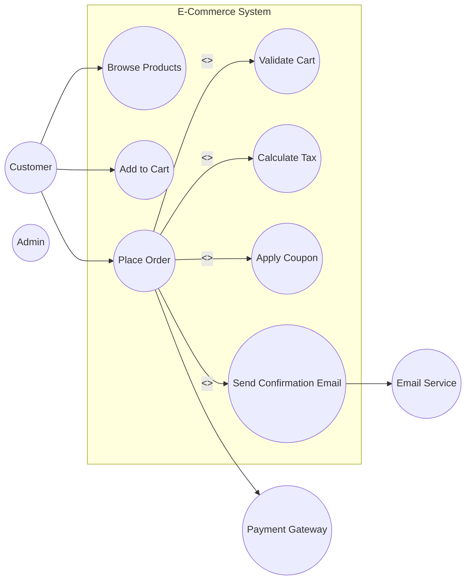
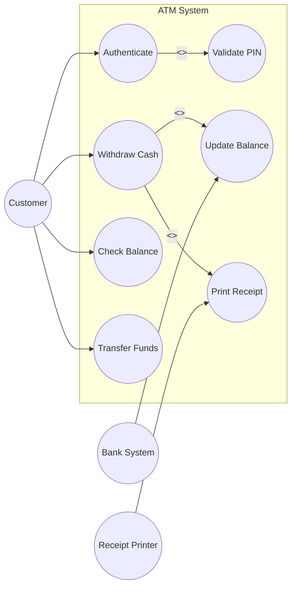

# UML Use Case Diagrams

---

## Definition

A **Use Case Diagram** represents the functional requirements of a system from an external perspective.

It answers:

> What does the system do?

It does NOT describe:
- Internal design
- Class structure
- Implementation logic
- Algorithm details

---

## When to Use

Use Case Diagrams are created during:

- Requirement gathering
- Feature planning
- Stakeholder discussions
- Early design phase

They help define system scope clearly.

---

# Core Components

---

## Actor

An **Actor** is an external entity interacting with the system.

Actors can be:
- Human users
- External systems
- Hardware devices
- Timers or schedulers

### Types of Actors

| Type | Description |
|------|------------|
| Primary | Initiates interaction |
| Secondary | Supports system operations |
| System Actor | External system |

---

## Use Case

A **Use Case** represents a specific goal or functionality provided by the system.

Naming rules:
- Use verb phrases
- Keep it goal-oriented
- From user perspective

Examples:
- Login
- Place Order
- Withdraw Cash
- Generate Report

---

## System Boundary

Defines what is inside the system and what is external.

Everything inside the boundary:
- Is owned by the system
- Is part of the application logic

Everything outside:
- Is an actor

---

# Relationships in Use Case Diagrams

---

## 1. Association

Shows interaction between actor and use case.

Represents:
- Who can trigger what

---

## 2. Include `(<<include>>)`

Indicates mandatory sub-functionality.

Meaning:
> Base use case always executes included use case.

Used for:
- Common reusable logic
- Avoiding duplication

Example:
- Place Order includes Validate Cart
- Withdraw Cash includes Update Balance

---

## 3. Extend `(<<extend>>)`

Indicates optional behavior.

Meaning:
> Extension executes only under certain conditions.

Used for:
- Optional features
- Conditional behavior
- Exception handling

Example:
- Checkout extends Apply Coupon
- Withdraw Cash extends Print Receipt

---

## 4. Generalization

Represents specialization between:
- Actors
- Use cases

Child inherits behavior of parent.

Example:
- Customer and Admin are types of User
- Credit Card Payment is a type of Payment

---

# Example : E-Commerce System

### Diagram


### Code
```java
// Actors are NOT classes in code - they represent external entities
// But we can represent them conceptually

// Primary Actor
// =======================
// Customer.java
// =======================
public class Customer {

    private final String id;
    private final String email;

    public Customer(String id, String email) {
        this.id = id;
        this.email = email;
    }

    public String getId() { return id; }
    public String getEmail() { return email; }
}

// =======================
// Product.java
// =======================
public class Product {

    private final String id;
    private final String name;
    private final double price;

    public Product(String id, String name, double price) {
        this.id = id;
        this.name = name;
        this.price = price;
    }

    public double getPrice() { return price; }
}

// =======================
// Cart.java
// =======================
import java.util.ArrayList;
import java.util.List;

public class Cart {

    private final List<Product> products = new ArrayList<>();

    public void addProduct(Product product) {
        products.add(product);
    }

    public List<Product> getProducts() {
        return products;
    }

    public double getTotalAmount() {
        return products.stream()
                .mapToDouble(Product::getPrice)
                .sum();
    }

    public boolean isEmpty() {
        return products.isEmpty();
    }
}

// =======================
// PaymentGateway.java (External)
// =======================
public interface PaymentGateway {

    boolean processPayment(String customerId, double amount);
}

// =======================
// EmailService.java (External)
// =======================
public interface EmailService {

    void sendEmail(String to, String message);
}


// =======================
// BrowseService.java
// =======================
import java.util.List;

public class BrowseService {

    public List<Product> browseProducts(List<Product> catalog) {
        return catalog;
    }
}

// =======================
// CartService.java
// =======================
public class CartService {

    public void addToCart(Cart cart, Product product) {
        cart.addProduct(product);
    }
}

// =======================
// OrderService.java
// =======================
public class OrderService {

    private final PaymentGateway paymentGateway;
    private final EmailService emailService;

    public OrderService(PaymentGateway paymentGateway,
                        EmailService emailService) {
        this.paymentGateway = paymentGateway;
        this.emailService = emailService;
    }

    // PlaceOrder
    public void placeOrder(Customer customer,
                           Cart cart,
                           boolean applyCoupon) {

        // <<include>> ValidateCart
        validateCart(cart);

        double amount = cart.getTotalAmount();

        // <<include>> CalculateTax
        amount = calculateTax(amount);

        // <<extend>> ApplyCoupon
        if (applyCoupon) {
            amount = applyCoupon(amount);
        }

        boolean paymentSuccess =
                paymentGateway.processPayment(customer.getId(), amount);

        if (!paymentSuccess) {
            throw new RuntimeException("Payment failed");
        }

        // <<include>> SendEmail
        sendConfirmationEmail(customer, amount);
    }

    private void validateCart(Cart cart) {
        if (cart == null || cart.isEmpty()) {
            throw new IllegalArgumentException("Cart is empty");
        }
    }

    private double calculateTax(double amount) {
        return amount + (amount * 0.18); // 18% tax
    }

    private double applyCoupon(double amount) {
        return amount * 0.90; // 10% discount
    }

    private void sendConfirmationEmail(Customer customer, double amount) {
        emailService.sendEmail(
                customer.getEmail(),
                "Order placed successfully. Amount paid: " + amount
        );
    }
}


```

## Example : LIbrary Management System


### Code
```java
// Entities
public class Book {
    private String isbn;
    private String title;
    private String author;
    private boolean isAvailable;
    private Date dueDate;
    
    public Book(String isbn, String title, String author) {
        this.isbn = isbn;
        this.title = title;
        this.author = author;
        this.isAvailable = true;
    }
    
    public boolean isAvailable() { return isAvailable; }
    public void setAvailable(boolean available) { isAvailable = available; }
    public Date getDueDate() { return dueDate; }
    public void setDueDate(Date dueDate) { this.dueDate = dueDate; }
    public String getTitle() { return title; }
}

public class Member {
    private String memberId;
    private String name;
    private List<Book> borrowedBooks;
    
    public Member(String memberId, String name) {
        this.memberId = memberId;
        this.name = name;
        this.borrowedBooks = new ArrayList<>();
    }
    
    public List<Book> getBorrowedBooks() { return borrowedBooks; }
    public void addBorrowedBook(Book book) { borrowedBooks.add(book); }
    public void removeBorrowedBook(Book book) { borrowedBooks.remove(book); }
    public String getName() { return name; }
}

// Use Cases
// Base Use Case
public class SearchBooksUseCase {
    private DisplayResultsUseCase displayResultsUseCase; // include
    
    public SearchBooksUseCase() {
        this.displayResultsUseCase = new DisplayResultsUseCase();
    }
    
    public List<Book> execute(String query) {
        System.out.println("Searching books for: " + query);
        
        // Simulate search
        List<Book> results = performSearch(query);
        
        // ALWAYS includes displaying results
        displayResultsUseCase.execute(results);
        
        return results;
    }
    
    private List<Book> performSearch(String query) {
        // Simulate database search
        List<Book> books = new ArrayList<>();
        books.add(new Book("ISBN001", "Design Patterns", "Gang of Four"));
        books.add(new Book("ISBN002", "Clean Code", "Robert Martin"));
        return books;
    }
}

public class DisplayResultsUseCase {
    public void execute(List<Book> books) {
        System.out.println("Displaying " + books.size() + " results:");
        for (Book book : books) {
            System.out.println("  - " + book.getTitle());
        }
    }
}

public class BorrowBookUseCase {
    private CheckAvailabilityUseCase checkAvailabilityUseCase; // include
    private UpdateInventoryUseCase updateInventoryUseCase; // include
    private ReserveBookUseCase reserveBookUseCase; // extend (optional)
    
    public BorrowBookUseCase() {
        this.checkAvailabilityUseCase = new CheckAvailabilityUseCase();
        this.updateInventoryUseCase = new UpdateInventoryUseCase();
        this.reserveBookUseCase = new ReserveBookUseCase();
    }
    
    public boolean execute(Member member, Book book) {
        System.out.println("\n=== Borrow Book Use Case ===");
        
        // ALWAYS includes checking availability
        boolean available = checkAvailabilityUseCase.execute(book);
        
        if (available) {
            // Mark as borrowed
            book.setAvailable(false);
            book.setDueDate(calculateDueDate());
            member.addBorrowedBook(book);
            
            // ALWAYS includes updating inventory
            updateInventoryUseCase.execute(book, false);
            
            System.out.println("Book borrowed successfully");
            return true;
        } else {
            // OPTIONAL: Reserve book if unavailable (extend)
            System.out.println("Book not available. Would you like to reserve?");
            return reserveBookUseCase.execute(member, book);
        }
    }
    
    private Date calculateDueDate() {
        Calendar cal = Calendar.getInstance();
        cal.add(Calendar.DAY_OF_MONTH, 14); // 14 days loan period
        return cal.getTime();
    }
}

public class CheckAvailabilityUseCase {
    public boolean execute(Book book) {
        System.out.println("Checking availability for: " + book.getTitle());
        return book.isAvailable();
    }
}

public class UpdateInventoryUseCase {
    public void execute(Book book, boolean isAvailable) {
        System.out.println("Updating inventory - Book: " + book.getTitle() + 
                         ", Available: " + isAvailable);
        book.setAvailable(isAvailable);
    }
}

// Extending use case (optional)
public class ReserveBookUseCase {
    public boolean execute(Member member, Book book) {
        System.out.println("Reserving book for member: " + member.getName());
        // Add to reservation queue
        return true;
    }
}

public class ReturnBookUseCase {
    private CalculateDueDateUseCase calculateDueDateUseCase; // include
    private PayFineUseCase payFineUseCase; // extend (optional)
    private UpdateInventoryUseCase updateInventoryUseCase; // include
    
    public ReturnBookUseCase() {
        this.calculateDueDateUseCase = new CalculateDueDateUseCase();
        this.payFineUseCase = new PayFineUseCase();
        this.updateInventoryUseCase = new UpdateInventoryUseCase();
    }
    
    public boolean execute(Member member, Book book) {
        System.out.println("\n=== Return Book Use Case ===");
        
        // ALWAYS includes checking due date
        boolean isOverdue = calculateDueDateUseCase.execute(book);
        
        // OPTIONAL: Pay fine if overdue (extend)
        if (isOverdue) {
            double fine = 50.0; // Rs. 50 fine
            boolean finePaid = payFineUseCase.execute(member, fine);
            if (!finePaid) {
                System.out.println("Cannot return book until fine is paid");
                return false;
            }
        }
        
        // Mark as returned
        book.setAvailable(true);
        book.setDueDate(null);
        member.removeBorrowedBook(book);
        
        // ALWAYS includes updating inventory
        updateInventoryUseCase.execute(book, true);
        
        System.out.println("Book returned successfully");
        return true;
    }
}

public class CalculateDueDateUseCase {
    public boolean execute(Book book) {
        if (book.getDueDate() == null) {
            return false;
        }
        
        boolean isOverdue = new Date().after(book.getDueDate());
        System.out.println("Checking due date - Overdue: " + isOverdue);
        return isOverdue;
    }
}

// Extending use case (optional)
public class PayFineUseCase {
    public boolean execute(Member member, double amount) {
        System.out.println("Processing fine payment for " + member.getName() + 
                         ": Rs. " + amount);
        // Process payment
        System.out.println("Fine paid successfully");
        return true;
    }
}

// Demo
public class LibraryUseCaseDemo {
    public static void main(String[] args) {
        // Create entities
        Member member = new Member("M001", "John Doe");
        Book book = new Book("ISBN001", "Design Patterns", "Gang of Four");
        
        // Use cases
        SearchBooksUseCase searchUseCase = new SearchBooksUseCase();
        BorrowBookUseCase borrowUseCase = new BorrowBookUseCase();
        ReturnBookUseCase returnUseCase = new ReturnBookUseCase();
        
        // Execute use cases
        searchUseCase.execute("Design");
        
        borrowUseCase.execute(member, book);
        
        // Simulate overdue
        Calendar cal = Calendar.getInstance();
        cal.add(Calendar.DAY_OF_MONTH, -20); // 20 days ago
        book.setDueDate(cal.getTime());
        
        returnUseCase.execute(member, book);
    }
}
```

# Example : ATM System


```java
// Entities

public class Customer {

    private String accountNumber;
    private String pin;

    public Customer(String accountNumber, String pin) {
        this.accountNumber = accountNumber;
        this.pin = pin;
    }

    public String getAccountNumber() {
        return accountNumber;
    }

    public String getPin() {
        return pin;
    }
}

public class Account {
    private String accountNumber;
    private String pin;
    private double balance;
    
    public Account(String accountNumber, String pin, double balance) {
        this.accountNumber = accountNumber;
        this.pin = pin;
        this.balance = balance;
    }
    
    public String getAccountNumber() { return accountNumber; }
    public String getPin() { return pin; }
    public void setPin(String pin) { this.pin = pin; }
    public double getBalance() { return balance; }
    public void setBalance(double balance) { this.balance = balance; }
}

public class Card {
    private String cardNumber;
    private String accountNumber;
    
    public Card(String cardNumber, String accountNumber) {
        this.cardNumber = cardNumber;
        this.accountNumber = accountNumber;
    }
    
    public String getCardNumber() { return cardNumber; }
    public String getAccountNumber() { return accountNumber; }
}

// System Actors (External Systems)
public interface BankSystem {
    Account getAccount(String accountNumber);
    boolean updateBalance(String accountNumber, double newBalance);
}

public class BankSystemImpl implements BankSystem {
    private Map<String, Account> accounts = new HashMap<>();
    
    public BankSystemImpl() {
        // Initialize with some accounts
        accounts.put("ACC001", new Account("ACC001", "1234", 10000));
        accounts.put("ACC002", new Account("ACC002", "5678", 5000));
    }
    
    @Override
    public Account getAccount(String accountNumber) {
        return accounts.get(accountNumber);
    }
    
    @Override
    public boolean updateBalance(String accountNumber, double newBalance) {
        Account account = accounts.get(accountNumber);
        if (account != null) {
            account.setBalance(newBalance);
            return true;
        }
        return false;
    }
}

public interface ReceiptPrinter {
    void print(String content);
}

public class ReceiptPrinterImpl implements ReceiptPrinter {
    @Override
    public void print(String content) {
        System.out.println("\n========== RECEIPT ==========");
        System.out.println(content);
        System.out.println("==============================\n");
    }
}

// Use Cases

public class AuthenticateUseCase {
    private ValidatePINUseCase validatePINUseCase; // include
    private BankSystem bankSystem;
    
    public AuthenticateUseCase(BankSystem bankSystem) {
        this.bankSystem = bankSystem;
        this.validatePINUseCase = new ValidatePINUseCase(bankSystem);
    }
    
    public Account execute(Card card, String pin) {
        System.out.println("\n=== Authentication ===");
        
        // Get account from bank system
        Account account = bankSystem.getAccount(card.getAccountNumber());
        
        if (account == null) {
            System.out.println("Account not found");
            return null;
        }
        
        // ALWAYS includes PIN validation
        boolean isValid = validatePINUseCase.execute(account, pin);
        
        if (isValid) {
            System.out.println("Authentication successful");
            return account;
        } else {
            System.out.println("Authentication failed");
            return null;
        }
    }
}

public class ValidatePINUseCase {
    private BankSystem bankSystem;
    
    public ValidatePINUseCase(BankSystem bankSystem) {
        this.bankSystem = bankSystem;
    }
    
    public boolean execute(Account account, String pin) {
        System.out.println("Validating PIN...");
        return account.getPin().equals(pin);
    }
}

public class WithdrawCashUseCase {
    private DispenseCashUseCase dispenseCashUseCase; // include
    private UpdateBalanceUseCase updateBalanceUseCase; // include
    private PrintReceiptUseCase printReceiptUseCase; // extend (optional)
    private BankSystem bankSystem;
    
    public WithdrawCashUseCase(BankSystem bankSystem, ReceiptPrinter printer) {
        this.bankSystem = bankSystem;
        this.dispenseCashUseCase = new DispenseCashUseCase();
        this.updateBalanceUseCase = new UpdateBalanceUseCase(bankSystem);
        this.printReceiptUseCase = new PrintReceiptUseCase(printer);
    }
    
    public boolean execute(Account account, double amount, boolean printReceipt) {
        System.out.println("\n=== Withdraw Cash ===");
        System.out.println("Requested amount: Rs. " + amount);
        
        // Check sufficient balance
        if (account.getBalance() < amount) {
            System.out.println("Insufficient balance");
            return false;
        }
        
        // ALWAYS includes dispensing cash
        boolean dispensed = dispenseCashUseCase.execute(amount);
        
        if (!dispensed) {
            System.out.println("Cash dispense failed");
            return false;
        }
        
        // ALWAYS includes updating balance
        double newBalance = account.getBalance() - amount;
        updateBalanceUseCase.execute(account, newBalance);
        
        // OPTIONAL: Print receipt if requested (extend)
        if (printReceipt) {
            String receiptContent = "Withdrawal: Rs. " + amount + "\n" +
                                  "Balance: Rs. " + newBalance;
            printReceiptUseCase.execute(receiptContent);
        }
        
        System.out.println("Withdrawal successful");
        System.out.println("New balance: Rs. " + newBalance);
        return true;
    }
}

public class DispenseCashUseCase {
    public boolean execute(double amount) {
        System.out.println("Dispensing cash: Rs. " + amount);
        // Simulate cash dispensing
        return true;
    }
}

public class UpdateBalanceUseCase {
    private BankSystem bankSystem;
    
    public UpdateBalanceUseCase(BankSystem bankSystem) {
        this.bankSystem = bankSystem;
    }
    
    public boolean execute(Account account, double newBalance) {
        System.out.println("Updating balance to: Rs. " + newBalance);
        account.setBalance(newBalance);
        return bankSystem.updateBalance(account.getAccountNumber(), newBalance);
    }
}

// Extending use case (optional)
public class PrintReceiptUseCase {
    private ReceiptPrinter printer;
    
    public PrintReceiptUseCase(ReceiptPrinter printer) {
        this.printer = printer;
    }
    
    public void execute(String content) {
        printer.print(content);
    }
}

public class CheckBalanceUseCase {
    public double execute(Account account) {
        System.out.println("\n=== Check Balance ===");
        double balance = account.getBalance();
        System.out.println("Current balance: Rs. " + balance);
        return balance;
    }
}

public class TransferUseCase {
    private VerifyAccountUseCase verifyAccountUseCase; // include
    private UpdateBalanceUseCase updateBalanceUseCase; // include
    private BankSystem bankSystem;
    
    public TransferUseCase(BankSystem bankSystem) {
        this.bankSystem = bankSystem;
        this.verifyAccountUseCase = new VerifyAccountUseCase(bankSystem);
        this.updateBalanceUseCase = new UpdateBalanceUseCase(bankSystem);
    }
    
    public boolean execute(Account fromAccount, String toAccountNumber, double amount) {
        System.out.println("\n=== Transfer ===");
        
        // Check sufficient balance
        if (fromAccount.getBalance() < amount) {
            System.out.println("Insufficient balance");
            return false;
        }
        
        // ALWAYS includes verifying destination account
        Account toAccount = verifyAccountUseCase.execute(toAccountNumber);
        
        if (toAccount == null) {
            System.out.println("Invalid destination account");
            return false;
        }
        
        // ALWAYS includes updating both balances
        updateBalanceUseCase.execute(fromAccount, fromAccount.getBalance() - amount);
        updateBalanceUseCase.execute(toAccount, toAccount.getBalance() + amount);
        
        System.out.println("Transfer successful");
        System.out.println("Transferred Rs. " + amount + " to " + toAccountNumber);
        return true;
    }
}

public class VerifyAccountUseCase {
    private BankSystem bankSystem;
    
    public VerifyAccountUseCase(BankSystem bankSystem) {
        this.bankSystem = bankSystem;
    }
    
    public Account execute(String accountNumber) {
        System.out.println("Verifying account: " + accountNumber);
        return bankSystem.getAccount(accountNumber);
    }
}

public class ChangePINUseCase {
    private ValidateOldPINUseCase validateOldPINUseCase; // include
    private BankSystem bankSystem;
    
    public ChangePINUseCase(BankSystem bankSystem) {
        this.bankSystem = bankSystem;
        this.validateOldPINUseCase = new ValidateOldPINUseCase();
    }
    
    public boolean execute(Account account, String oldPIN, String newPIN) {
        System.out.println("\n=== Change PIN ===");
        
        // ALWAYS includes validating old PIN
        boolean isValidOldPIN = validateOldPINUseCase.execute(account, oldPIN);
        
        if (!isValidOldPIN) {
            System.out.println("Invalid old PIN");
            return false;
        }
        
        // Update PIN
        account.setPin(newPIN);
        System.out.println("PIN changed successfully");
        return true;
    }
}

public class ValidateOldPINUseCase {
    public boolean execute(Account account, String oldPIN) {
        System.out.println("Validating old PIN...");
        return account.getPin().equals(oldPIN);
    }
}

// Demo
public class ATMUseCaseDemo {
    public static void main(String[] args) {
        // Setup
        BankSystem bankSystem = new BankSystemImpl();
        ReceiptPrinter printer = new ReceiptPrinterImpl();
        
        Card card = new Card("CARD001", "ACC001");
        
        // Use cases
        AuthenticateUseCase authUseCase = new AuthenticateUseCase(bankSystem);
        WithdrawCashUseCase withdrawUseCase = new WithdrawCashUseCase(bankSystem, printer);
        CheckBalanceUseCase balanceUseCase = new CheckBalanceUseCase();
        TransferUseCase transferUseCase = new TransferUseCase(bankSystem);
        ChangePINUseCase changePINUseCase = new ChangePINUseCase(bankSystem);
        
        // Scenario 1: Authenticate
        Account account = authUseCase.execute(card, "1234");
        
        if (account != null) {
            // Scenario 2: Check balance
            balanceUseCase.execute(account);
            
            // Scenario 3: Withdraw with receipt
            withdrawUseCase.execute(account, 2000, true);
            
            // Scenario 4: Transfer
            transferUseCase.execute(account, "ACC002", 1000);
            
            // Scenario 5: Change PIN
            changePINUseCase.execute(account, "1234", "5678");
            
            // Final balance check
            balanceUseCase.execute(account);
        }
    }
}
```

****
### Include vs Extend Comparison
| Aspect          | Include               | Extend                   |
| --------------- | --------------------- | ------------------------ |
| Execution       | Always                | Optional                 |
| Purpose         | Reuse common behavior | Add conditional behavior |
| Arrow Direction | Base → Included       | Extending → Base         |
| Dependency      | Mandatory             | Conditional              |
