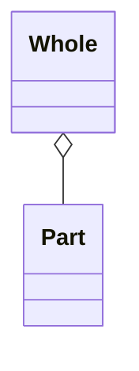
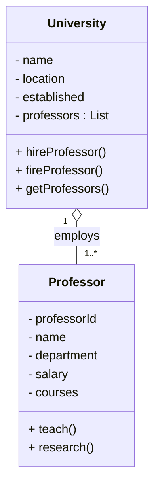
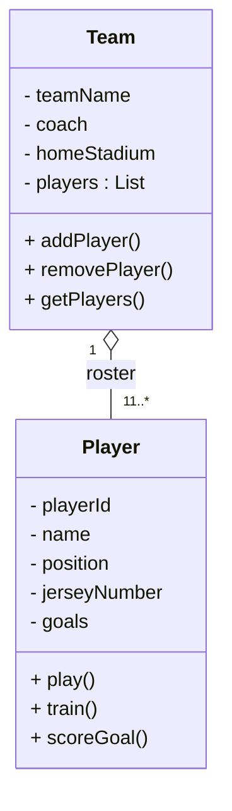
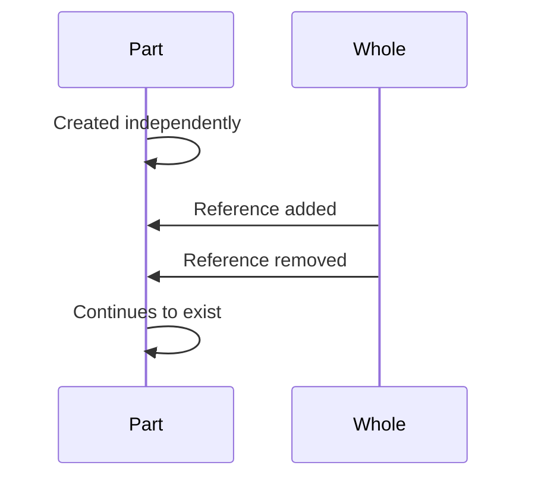

# Aggregation (Has-A / Weak Ownership)

Aggregation is a specialized form of **association** that models a **whole–part relationship** where the part can exist independently of the whole.

This document focuses on structural modeling of aggregation using UML and real-world design scenarios.  
The goal is to highlight **lifecycle independence**, **shared ownership**, and **weak containment semantics**.

---

# Definition

Aggregation represents a **whole–part relationship** where the **whole references the part but does not control its lifecycle**.

The part can exist without the whole and may be shared across multiple wholes.

Key property:

Parts are **not destroyed** when the whole is destroyed.

---

# Real-World Analogy

A **Department has Employees**.

If the department closes:

- Employees still exist.
- Employees can join another department.

The department groups employees but **does not own their lifecycle**.

---

# Characteristics

- Part can exist independently of the whole
- Weak ownership relationship
- Shared ownership is possible
- Lifecycle independence
- Represents a logical grouping
- Parts may belong to multiple wholes

Aggregation expresses **organizational containment**, not lifecycle containment.

---

# UML Notation

Aggregation is represented using a **hollow diamond** on the side of the whole.

****
# Example: University & Professor
### Scenario
**A University has Porfessor**

Professor:
- Exist independently
- Can move between universities
- continue to exist even if university closes

### Class Diagram

### Structural Interpretation
- The **University** aggregates **Professors**
- Professors are not Created or Destroyed by University
- Professor may move between univerisities
- Multiple universities may reference to same professor during collabration

The lifecycle of Professor is independent of University.
****
# Example: Team & Player
### Scenario
**A Team has Players.**

Players:
- Exist independently of teams
- Can transfer between teams
- Continue their careers even if a team disbands

### Class Structure

### Structural Interpretation
- Team maintains a roster of Players.
- Players are independent domain entities.
- Removing a player from a team does not destroy the player.
- Players may join new teams.

Aggregation models membership, not ownership.

---
# Design Interpretation
Aggregation indicates:
- Logical ownership
- Organizational grouping
- Independent lifecycle
- Potential sharing between containers

Aggregation does not imply:
- Memory ownership
- Lifecycle control
- Cascading deletion

# Final Words
**Aggregation** guarantees **independent** lifecycles.

Example lifecycle sequence:
1. Part object is created.
2. Whole references the part.
3. Whole may remove the reference.
4. Part continues to exist independently.

