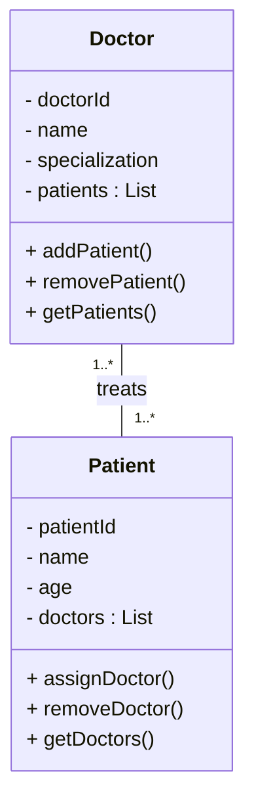
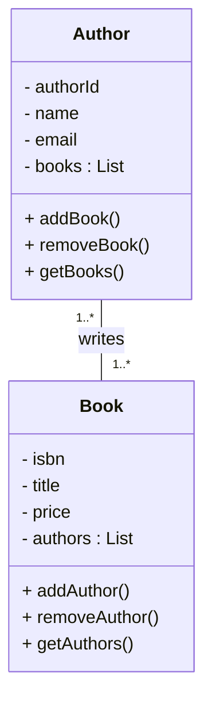
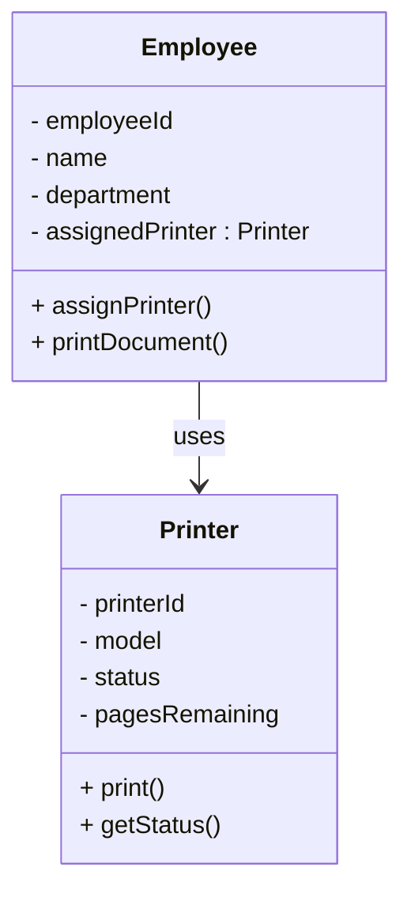

# Association ( "Uses-A" Relationship) – Deep Structural Analysis

This document analyzes **Association** from a structural and modeling perspective.  
The focus is on lifecycle independence, navigation direction, multiplicity constraints, and class-level interaction modeling.

Association represents collaboration — not ownership.

---

# Definition

Association is a structural relationship where one class holds a reference to another for interaction.

Core properties:

- Independent lifecycles
- No ownership
- No automatic lifecycle propagation
- Navigation may be unidirectional or bidirectional

Association models communication between objects.

---

# Structural Characteristics

- Weak structural coupling
- Multiplicity defines quantitative constraints
- Can represent one-to-one, one-to-many, or many-to-many relationships
- Does not imply containment
- Does not imply lifecycle control

If lifecycle dependency exists, association is incorrect.

---

# Example: Doctor & Patient (Bidirectional Many-to-Many)

## Scenario

- Doctor treats multiple Patients.
- Patient consults multiple Doctors.
- Neither controls the lifecycle of the other.

---

## Class Diagram

## Structural Analysis
- Both classes maintain references.
- Association is bidirectional.
- Multiplicity enforces domain constraint.
- Removal of Doctor does not delete Patients.
- Removal of Patient does not delete Doctors.
`Bidirectional associations increase synchronization complexity and must maintain consistency on both sides.`
****
# Example: Author & Book (Bidirectional Many-to-Many)
## Scenario
- Author writes multiple books
- Book may have multple Authors

## Class Diagram

## Structural Analysis
- Pure collaboration.
- Independent lifecycles.
- No containment semantics.
- Many-to-many association.
- Implementation may require association entity at persistence layer.

`Association reflects authorship, not ownership.`
# Example: Employee Uses Printer (Unidirectional Association)
## Scenario
- Employee uses Printer
- Printer doesn't maintain the reference to Employee

## Class Diagram

