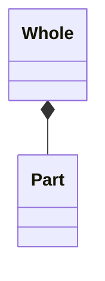
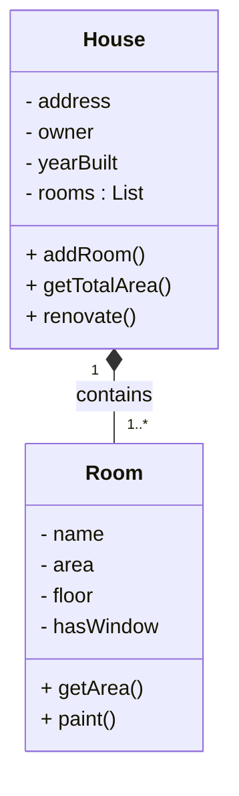
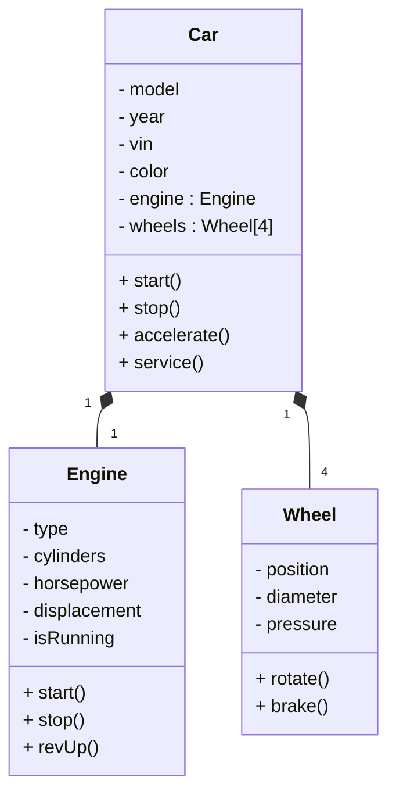

# Composition (Part-Of / Strong Ownership)

Composition is a strong form of aggregation representing a **whole–part relationship with strict lifecycle dependency**.  
The whole **exclusively owns the parts** and is responsible for their creation, existence, and destruction.

This document focuses on structural modeling of composition in UML, emphasizing **ownership semantics, lifecycle control, and architectural meaning**.

---

# Definition

Composition represents a relationship where the **part cannot exist independently of the whole**.

Key rule:

If the whole is destroyed, the parts are destroyed as well.

The whole exclusively manages the lifecycle of its parts.

---

# Real-World Analogy

A **House contains Rooms**.

Rooms:

- are created as part of the house
- belong to that house only
- cannot exist independently

If the house is demolished, the rooms cease to exist.

---

# Characteristics

- Strong ownership by the whole  
- Lifecycle dependency between whole and part  
- Parts are created by the whole  
- Parts cannot exist independently  
- Parts cannot be shared between multiple wholes  
- Cascading deletion when the whole is destroyed  
- Tight structural coupling

Composition represents **structural containment with lifecycle control**.

---

# UML Notation

Composition is represented by a **filled diamond on the whole side**.

# Composition vs Aggregation
| Aspect    | Composition                | Aggregation                    |
| --------- | -------------------------- | ------------------------------ |
| Ownership | Strong / Exclusive         | Weak / Shared                  |
| Lifecycle | Parts die with whole       | Parts live independently       |
| Creation  | Whole creates parts        | Parts exist before association |
| Sharing   | Not allowed                | Allowed                        |
| Example   | House ♦─ Room              | University ◇─ Professor        |
| Deletion  | Parts destroyed with whole | Parts continue to exist        |

Composition introduces **strict containment semantics**, while aggregation models logical grouping.

----
# Example: House & Rooms
### Scenario
A **House consists of multiple Rooms**

**Rooms**
- are created during house creationg/building
- belong to that house only
- are destroyed when the house is demolished
- it means Rooms can't exist independently, lifecycle is controlled by House.

### Structural Interpretation
- House creates and manages rooms
- Rooms cannot exist independently
- A room cannot belong to another house
- Destroying a House removes all rooms
-----

# Example: Car, Engine and Wheels
### Scenario
A **Car contains Engine and Wheels**

**Engine and Wheels**
- are created as part of the Car
- cannot exist meaningful outside of the car
- are destroyed when the car scrapped

----

# Final Words
### When to use Composition:
- The relationship is strictly part-of
- The whole creates its parts
- Parts cannot exist independently
- Parts cannot be shared
- Parts belong to exactly one whole
- Destruction of whole destroys all parts

### Example
- House ➡ Rooms
- Car ➡ Engine
- Book ➡ Chapter
- Order ➡ OrderItems

### When not to use Composition
- The part can exist independently
- The part may belong to multiple containers
- The lifecycle of the part is not controlled by the whole

**Composition models exclusive ownership and lifecycle control.**

  