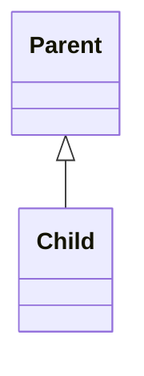
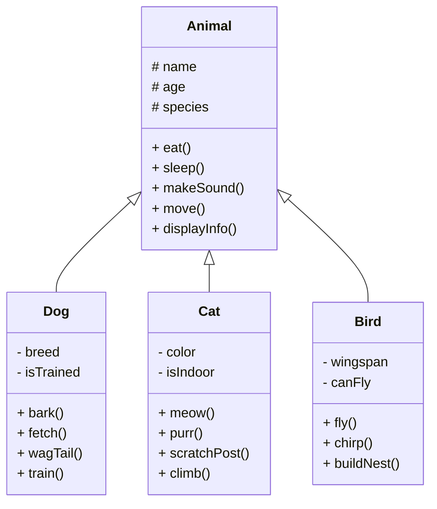
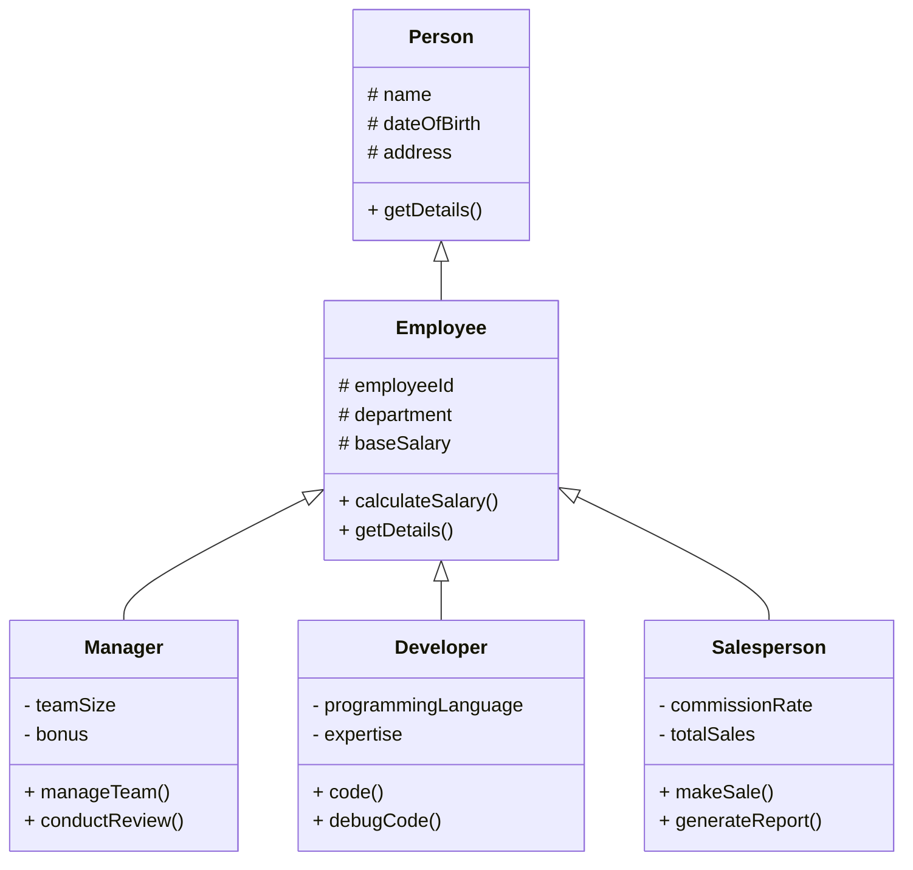
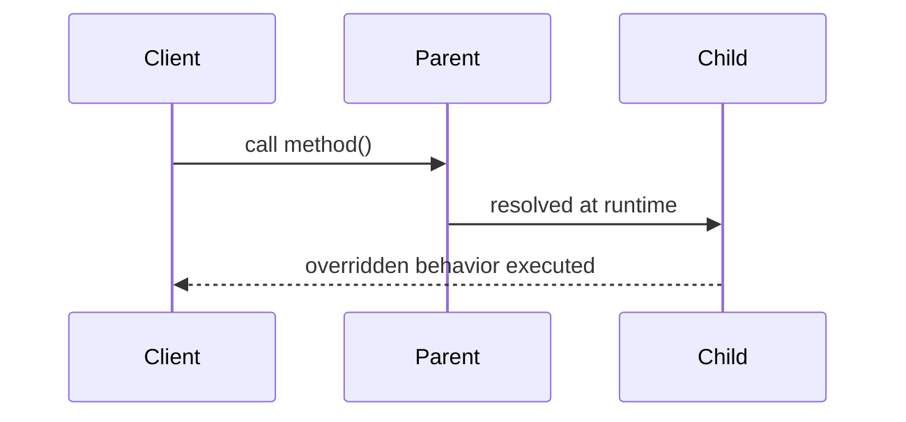

# Inheritance (Is-A Relationship)

Inheritance is a structural mechanism where a class derives properties and behaviors from another class, forming an **Is-A relationship**.

This document focuses on structural hierarchy, behavioral specialization, and polymorphic interaction using UML.

---

# Definition

Inheritance allows a **child class to extend a parent class**, inheriting attributes and behaviors while introducing specialization.

Key rule:

A child **is a type of** parent.

---

# Real-World Analogy

- Car **is a** Vehicle  
- Dog **is an** Animal  
- Manager **is an** Employee  

Inheritance models **classification hierarchy**.

---

# Characteristics

- Code reuse through inherited behavior  
- Method overriding for specialization  
- Supports polymorphism  
- Defines hierarchical structure  
- Strong coupling between parent and child  
- Child extends parent, not owns it  
- Single inheritance for classes (in Java context)  

Inheritance models **type hierarchy**, not composition or containment.

---

# UML Notation

Inheritance is represented using a **solid line with a hollow triangle pointing to the parent**.

**As we already go through about inheritance and its type in OOPs we will be focused on it's example**

# Example: Animal Hierarchy (Single + Hierarchical)
### Scenario
`An animal classification system where multiple types derive from a common base.`

### Structural Interpretation
- Animal defines common behavior contract.
- Dog, Cat, Bird provide specialized implementations.
- Parent reference can represent all child types.
- Hierarchy supports polymorphic behavior.

This models **type specialization**, not ownership.

--------	
# Example: Employee Hierarchy
### Scenario
A company structure with layered Inheritance.

### Structural Interpretation
- Multi-level hierarchy: Person → Employee → Role-specific classes
- Common behavior defined at higher abstraction
- Specialized behavior added at lower levels
- Salary calculation overridden based on role

This models **progressive specialization across hierarchy levels.**

-----

# Final Words
-Inheritance is powerful but dangerous when misused. It creates rigid hierarchies that are hard to change.
- If the relationship is not a true** "Is-A"**, forcing inheritance will break substitutability and lead to design corruption.
- Deep inheritance trees reduce clarity and increase unintended side effects across the system.
- Prefer inheritance only when behavioral polymorphism is required, not just for code reuse.
- If you feel the need to override too many methods or bypass parent behavior, the hierarchy is already wrong.
- In modern system design, inheritance is often replaced with composition for flexibility, and used selectively for modeling true taxonomy.

### Behavioural Perspective

### Key Concepts
**Method Overriding**
Child provides specific implementation of parent behavior.

**Polymorphism**
Parent reference can refer to child objects.

**Constructor Chaining**
Parent constructors are invoked during child creation.

**Access Control**
Protected members allow controlled inheritance visibility.

### Design Interpretation
Inheritance represents:
- Type hierarchy
- Behavioral specialization
- Shared abstraction

Inheritance does NOT represent:
- Ownership
- Lifecycle dependency
- Structural containment
-----